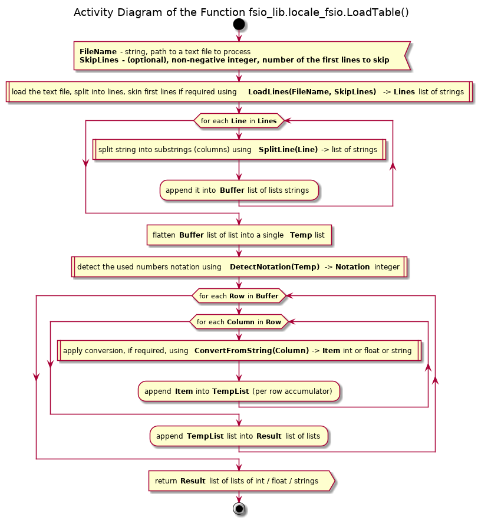
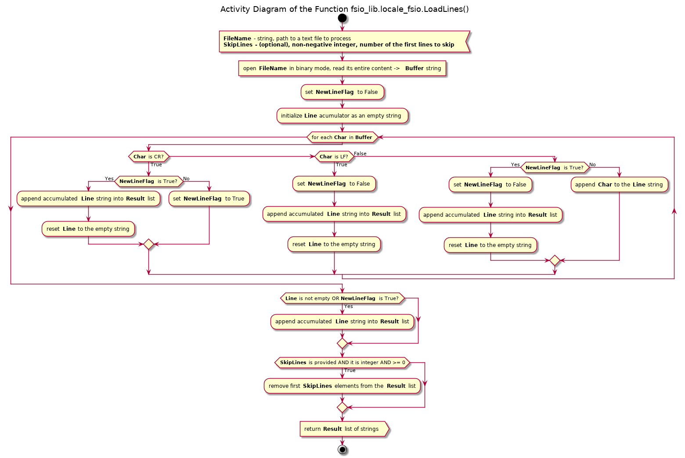
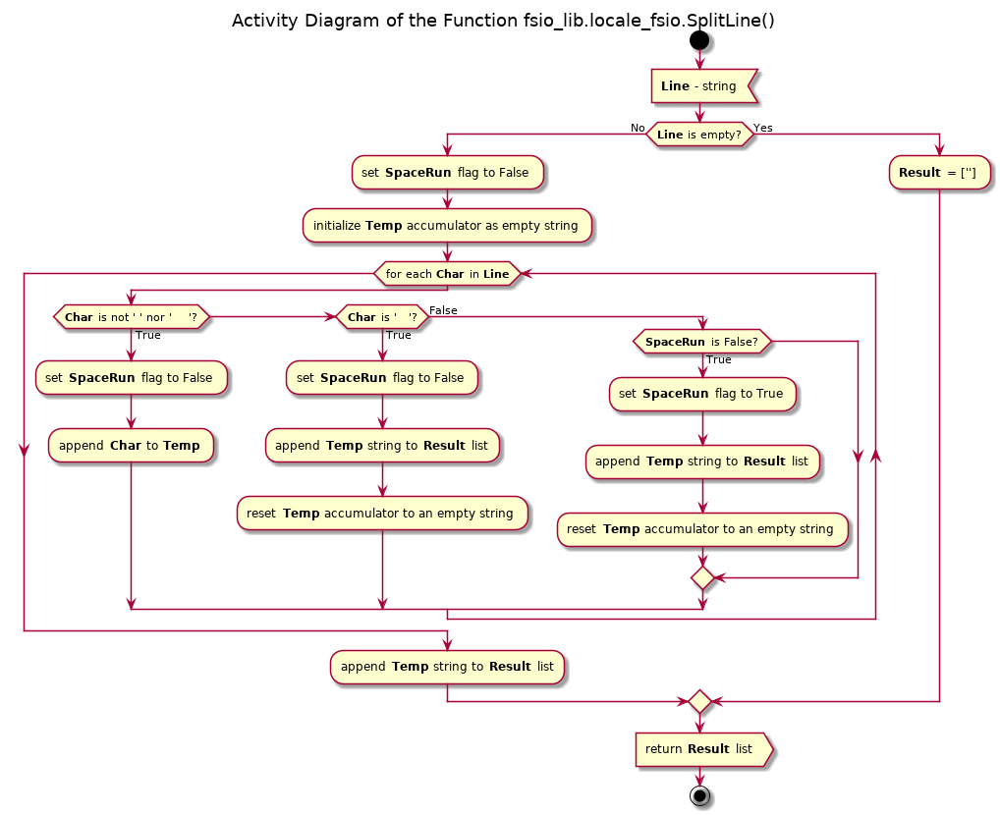
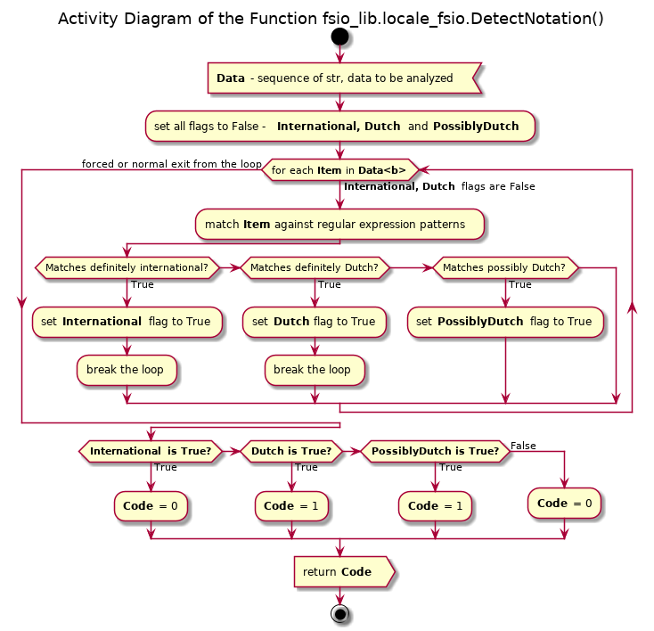
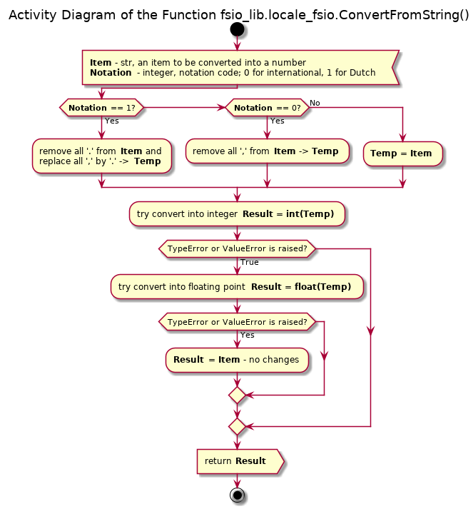

# UD004 Reference on the Module fsio_lib.locale_fsio

## Scope

This document describes the design, intended usage, implementation details and API of the module *locale_fsio*, which implements a number of functions for proper reading data from the TSV (ASCII text) files regardless of the used conventions on the line ending, number format (decimal separator used and optional decimal delimiter) and TABs or usual spaces for the column separation. Implemented functions are:

* **SaveForcedNewLine**()
* **LoadTable**()
* **LoadLines**()
* **SplitLine**()
* **DetectNotation**()
* **ConvertFromString**()

## Intended Functionality and Use

With the batch processing of the TSV data files the inconsistency (between the files) of the storage format is often an impeding factor. The three most common problems are:

* the line ending (LF, CR or CRLF)
* use of TABs or usual spaces (fixed or variable width) for the columns separation
* the localization of the numbers representation format - i.e. use of comma (',') instead of dot ('.') as decimal separator and, the most annoying - use of decimal delimiter.

The standard method **readlines**() of the Python file objects properly splits a text file into line when LF (Unix) or CRLF (Windows) new line convention is used, but it fails with the CR convention. In addition, this method does not remove the end line characters. The manual removal of the line ends using *some_string.rstrip('\n').rstrip('\r')* removes the end of line characters for both LF and CRLF conventions and preserves the tailing white spaces, but it is cumbersome.

The standard construct *some_string.split('\t')* properly splits a line into sub-strings when only TABs are used as the columns separators, but it is not applicable in the case of the fixed or variable width usual spaces tabulation, whereas the construct *some_string.split()* treats any length run of usual spaces intermixed with TABs as a single separator.

Finally, the standard conversion of a quoted number (string) into integer **int(quoted_number)** or **float(quoted_number)** works properly when dot ('.') is used as the decimal separator, and there are no decimal delimiters, but it fails on strings containing decimal separators (comma ','). The Dutch numbers notation convention is reversed - ',' comma for separator and '.' dot for delimiter. Many data files generated by legacy software suffer from this effect, and they must be converted into standard notation before processing.

Therefore, the purpose of this module is to provide a unified TSV processing functionality, which:

* automatically detects the used new line convention LF, CR or CRLF on *per line* level, thus the mixture of conventions in one file is allowed - for instance, some log or alike file periodically updated from the different OSes
* properly splits the file into lines and deletes the end of line characters based on this dynamic EOL detection, while preserving the tailing white spaces (TABs and usual spaces)
* properly splits each line into sub-strings (columns) using the following rules:
  * any continuous run of usual spaces (0x20, ASCII 32) between any other characters (or start / end of the line) is treated as a single TAB character (0x09, ASCII 9)
  * each TAB or equivalent usual spaces run is treated as a separator between two columns
  * leading TAB or usual spaces run is treated as an *empty* column before them (represented by empty sub-string '')
  * tailing TAB or usual spaces run is treated as an *empty* column after them
  * two consecutive TABs or TAB followed by a space run or space run followed by a TAB is treated as an *empty* column between them
* automatically detects the used numbers notation (international computer standard or Dutch) and removes the decimal delimiters and converts the decimal separator comma into dot when required - on the *per file* level

This module is designed as complement to the TSV file parse within the GenericParsers module, but it is useful on its own.

## Design and Implementation

Two functions are concerned to be 'main', which are most useful: **SaveForcedNewLine**() and **LoadTable**().

The function **SaveForcedNewLine**() enforces the specific line ending convention during saving of a file. It requires a sequence of strings without new line characters as the input. The file is open for writing (overwrites the existing data) in the *binary* mode. Each line is saved into a file one at the time and is followed by the enforced line ending combination, e.g. LF, CR or CRLF. The MS Windows CRLF convention is the default and is used unless the required line ending is explicitly passed as the second optional argument (or as a keyword).

The function **LoadTable**() loads the text file, optionally skipping the passed as the second optionally argument number of first lines. The file is split into lines properly by the function **LoadLines**() regardless of the used new line convention (CR, LF or CRLF - even mixture of them in one file is allowed). The line endings are removed, whilst the tailing TABs or usual spaces are preserved. Then each line is split into elements (sub-strings as columns) with the help of the function **SplitLine**(). Continuous run of usual spaces is treated as a single TAB. Two TABs in a row, or a TAB followed by at least one usual space, or usual spaces continuous run followed by a TAB are treated as an empty column between them, represented by an empty string in the result. The leading and tailing TABs / spaces are treated as empty columns before and after them respectively. The data is fed into the function **DetectNotation**(), which determines the used number notation: international or Dutch. The function **ConvertFromString**() is applied to each substring with the determined notation code; this function removes the decimal delimiters, performs conversion of decimal separator ',' comma into '.' dot, and converts the quoted numbers (integer or float) into **int** / **float** types respectively, if possible. The activity diagram of the function **LoadTable**() is given in the figure below.



The **LoadLines**() function itreats the entire content of a file as a stream of characters (bytes) one character at the time, which are accumulated in a string buffer.

The work flow is based on the *accumulator filling* run, i.e. continuous feeding the buffer with data, until one of the terminating characters is read. Unless the End Of File is reached, the termination of one run automatically starts the next run. The following simple rules are applied:

* Encountered CR character ('\r') is not buffered itself, but delays the termination of the run until the next character is read
  * if the previous character in the stream was also CR, the previous run is terminated and the new is started (and its termination delay is already set!)
* Encountered LF character ('\n') forces the transfer of the data accumulated in the string buffer into the list to be returned as the result as a single entry - string; the LF character itself is not stored in the buffer, and the string buffer is reset to an empty string - which starts a new run cycle
* Encountered End Of File unconditionally terminates the current accumulation run and enforces the accumulator data transfer if:
  * the accumulator string (buffer) is not empty
  * OR the last read character is CR even if the accumulator is empty
* Any other character encountered:
  * if the delayed termination of the run is set - terminates the last run, forces the accumulator data transfer and reset of both the accumulator and the delayed termination flag, and starts the new accumulation run + puts the read character into the accumulator
  * if the delayed termination of the run is not set - simply puts the read character into the accumulator



The **SplitLine**() function operates on similar principle but concerning the string splitting by TABs or continuous run of usual spaces. The passed string is processed one character at a time using a string buffer to accumulate the characters read until a terminating character is encountered: a usual space, a TAB of the end of the string.

* Encountered TAB character ('\t') is not buffered, but it terminates the current *accumulator filling* run, transfers the accumulated data (even if the accumulator is an empty string) into the list to be returned, resets the *spaces run* flag and empties the accumulator
* Encountered usual space (' '):
  * if the *spaces run* flag is set (last one or more read character(s) is / are spaces) - this space is simply ignored
  * if the *spaces run* flag is not set - the current *accumulator filling* run is terminated, the accumulated data (even if the accumulator is an empty string) is transfered into the list to be returned, and the *spaces run* flag is set
* Encountered character except TAB and usual space resets the *spaces run* flag, and the character is fed into the accumulator
* When the end of the string is reached, the data from the accumulator is transferred into the list to be returned, even if the accumulator is an empty string



The **DetectNotation**() function analyzes the passed sequence of strings by matching each element in turn against regular expression patterns, until it finds a quoted number, which notation can be unambiguously interpreted as Dutch or international notation (which automatically terminates the search), or the end of the sequence is reached. If it encounters a quoted number, which can possibly by in Dutch numbers notation (but not 100% sure), as special flag is set.

Upon the forced or normal (by reaching the end) exit from the loop the states of three flags are analyzed:

* Either definitely Dutch or international notation flag is set - return the corresponding code
* Neither definitely Dutch nor international flag is set but the possibly Dutch is set - return the Dutch notation code
* Neither of the free flags is set - return the code for the default (international) notation

The corresponding regular expression patterns are:

```python
#+ definitely dutch number representation regular patters

RE_NL1 = re.compile(r'(^|\D)(\+|-)?\d+,\d*(E|e)(\+|-)?\d*($|\D)')
RE_NL2 = re.compile(r'(^|\D)(\+|-)?\d{1,3}\.\d{3}(\.\d{3})+($|\D)')
RE_NL3 = re.compile(r'(^|\D)(\+|-)?\d{1,3}(\.\d{3})+,\d*($|\D)')
RE_NL4 = re.compile(r'(^|\D)\d+,(\d{1,2}|\d{4}\d*)($|D)')

#+ possibly dutch number representation regular patters

RE_NL5 = re.compile(r'(^|\D)\d+,\d*($|D)')

#+ definitely international number representation regular patters

RE_INT1 = re.compile(r'(^|\D)(\+|-)?\d+\.\d*(E|e)(\+|-)?\d*($|\D)')
RE_INT2 = re.compile(r'(^|\D)(\+|-)?\d{1,3},\d{3}(,\d{3})+($|\D)')
RE_INT3 = re.compile(r'(^|\D)(\+|-)?\d{1,3}(,\d{3})+\.\d*($|\D)')
RE_INT4 = re.compile(r'(^|\D)\d+\.(\d{0,2}|\d{4}\d*)($|D)')
```



Finally, the function **ConvertFromString**() removes the decimal delimiters (',' or '.' for the international / Dutch notation code passed), replaces the decimal separator ',' comma by '.' dot (if the Dutch notation code is passed). Then it tries to convert it into integer, which is returned unless an exception is raised. If the exception is raised - the function attempts to convert into float, which is returned, unless the conversion failed as well. If it is not possible to convert the modified string into neither integer nor float - the original, not modified string is returned.



## API Reference

### Functions

**SaveForcedNewLine**(strFileName, strseqLines, strNewLine = '\r\n')

Signature:

str, seq(str)/, str = '\r\n'/ -> None

Args:

* *strFileName*: str, name of the file to write into (creates / re-writes)
* *strseqLines*: seq(str), any sequence of the strings (ASCII supposed) to be saved into the file
* *strNewLine*: (optional) str, the line ending style, e.g. '\n' (LF) or '\r\n' (CRLF). Defaults to the Windows convention CRLF.

Description:

Saves the passed sequence of strings as lines in a text files and enforces the specific line ending.

**LoadLines**(strFileName, iSkipLines = 0)

Signature:

str/, int >= 0/ -> list(str)

Args:

* *strFileName*: str, name of (path to) the file to read
* *iSkipLines*: (optional) int, not negative, the number of the first lines to skip, defaults to 0; non-integer or negative values are ignored

Returns:

* list(str): content of the file (excluding optional several lines as requested), split into lines

Description:

Loads a file, splits it into lines (as strings), strips the end line characters (CR and LF - alone or in CRLF combination), (optionally) skips the first *iSkipLines*, and returns the result as a list of strings.

**SplitLine**(strLine)

Signature:

str -> list(str)

Args:

* *strLine*: str, line to split

Returns:

* list(str): line split into elements (strings as columns)

Description:

Splits the passed string into substrings, returned as a list of strings, by a single TAB or an arbitrary amount of spaces. Tailing and leading TABs or spaces are also converted into empty strings (columns). An empty string is converted into a list containing a single element - an empty string.

**DetectNotation**(strseqSamples)

Signature:

seq(str) -> int

Args:

* *strseqSamples*: seq(str), any sequence of strings

Returns:

* int: 0 for the international, 1 for Dutch notation

Description:

Determines the number notation used in the input (file) by matching each string from the passed sequence against defined (as globals) regular expression patterns until a definite match is found, i.e. unambiguous case of the number notation. If no definite matches is found, tries more ambiguous pattern(s). If still no matches - assumes the default international notation.

**ConvertFromString**(strItem, iNotation)

Signature:

str, int -> int OR float OR str

Args:

* *strItem*: str, string to be converted
* *iNotation*: int, 0 for international, 1 for Dutch

Returns:

* int: if conversion to int is successful
* float: if conversion to int is not successful but to the float is ok
* str: the original string if cannot into int or float

Description:

Removes the decimal delimiters, replaces the decimal separator as ',' (comma) by '.' (dot) and attempts to convert the resulting string into an integer or a float (if failed to int). If conversion to float also failed returns the original string.

**LoadTable**(strFileName, iSkipLines = 0)

Signature:

str/, int >= 0/ -> list(list(int OR float OR str))

Args:

* *strFileName*: str, name of (path to) a file to load
* *iSkipLines*: (optional) int, non-negative, number of the first lines to skip, defaults to 0. Non-integer or negative value is ignored

Returns:

* list(list(int OR float OR str)): the tabulated data converted into nested lists (equal number of columns is not guaranteed), with the values of the 'cells' converted into int or float when possible

Description:

Generic locale-independent loader of a data file saved in a TSV format with:

* CR, LF or CRLF line endings
* TABs or arbitrary amount of spaces (as a single TAB) for the columns separation
* proper treatment of the 'empty' columns in the beginning or end of a line (row)
* proper treatment of the numbers notation in Dutch and English notation (i.e. ',' or '.' as the decimal separator) with or without the decimal delimiters ('.' or ',' respectively)