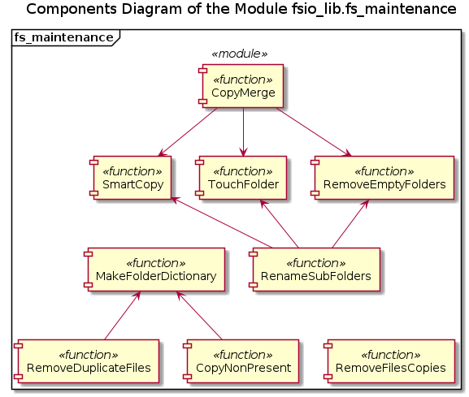
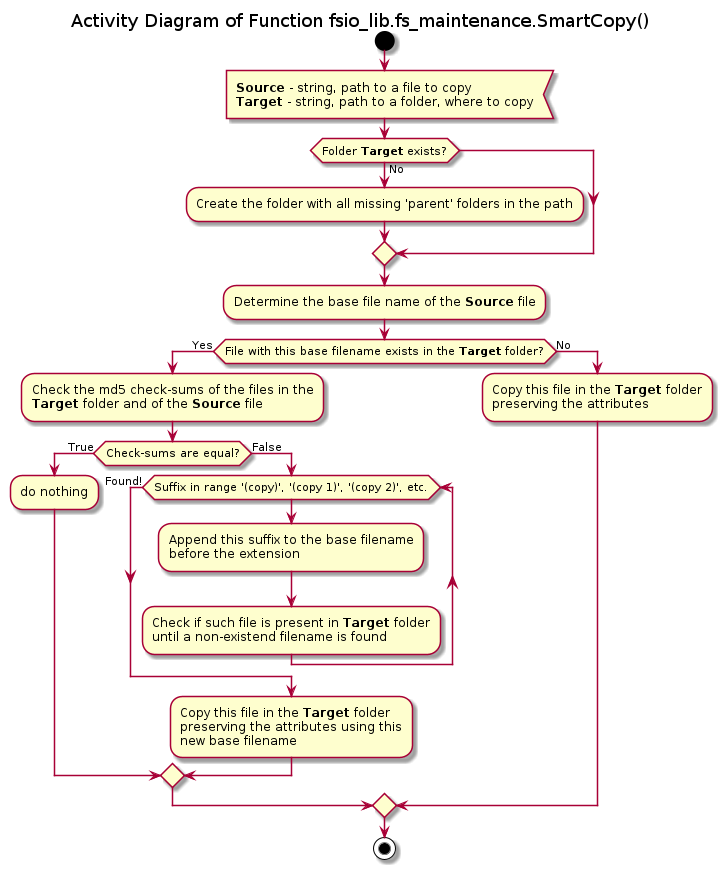
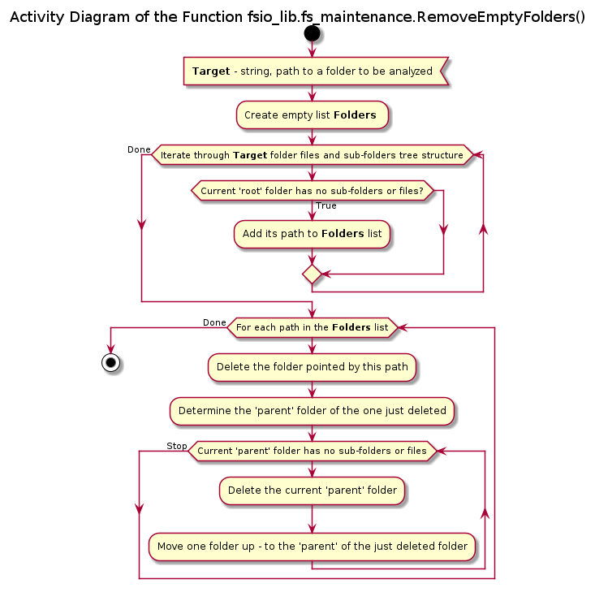
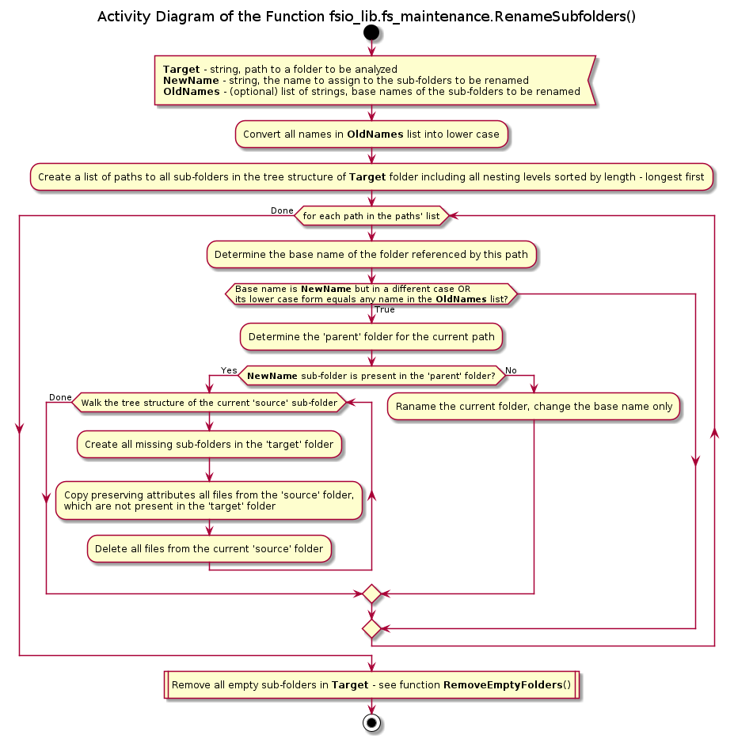
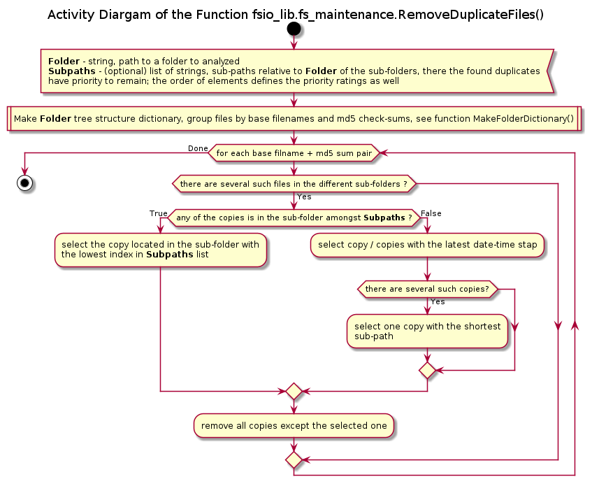
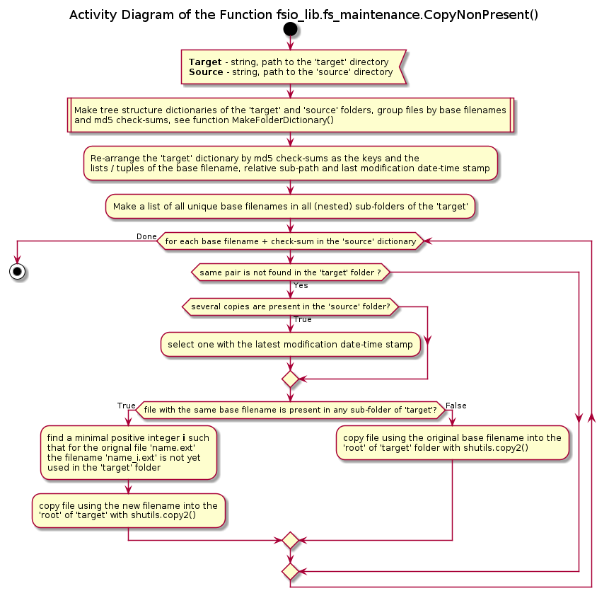
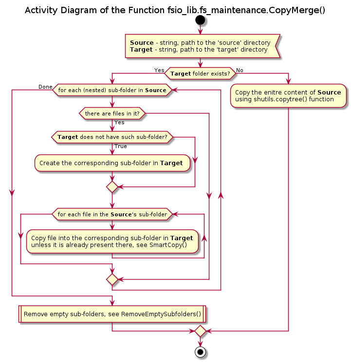

# UD005 Module fs_maintenance Reference

## Scope

This document provides user's and programmer's reference for the module *fsio_lib.fs_maintenance*: intended functionality and use, design implementation details and API reference. It covers the implemented in the module functions:

* *SmartCopy*()
* *TouchFolder*()
* *RemoveEmptyFolders*()
* *RenameSubfolders*()
* *RemoveDuplicateFiles*()
* *RemoveFilesCopies*()
* *CopyNonPresent*()
* *CopyMerge*()

## Intended Functionality and Use

The purpose of this module is to provide enhanced functionality for files and folders copying useful for one-way slave -> master synchronization of structured files collections without a back-end indexing system or a search database: e.g., photos or music collections, Device History Records, etc. Without a proper indexing system or, even better, a maintenance database and file system modification API, the manual updates of the collection often result in unwanted duplication of the data, especially when a collection aggregates files, which can originate from different sources independently.

Depending on the OS settings and user's input the base filenames conflict is usually resolved using one of the following 3 scenarios:

* The initial file is overwritten by the new one
* The new file from the alternative source is not copied (skipped)
* The new file is copied with the modified base filename

This module provides an alternative logic, which does not require user's input for the name conflict's resolution and prevents data duplication. It is based on the concept of the files' *identicity*. Two files are *identical* if and only if they have the same base filenames and md5 check-sums. Thus, considering the 'source' and 'target' folders:

* The file from 'source' is not copied if there is an identical file in the 'target'
* The file from 'source' is copied into the 'target' preserving the base filename and date-time stamps when 'target' does not contain an identical file
* The file from 'source' is copied into the 'target' preservig the date-time stamps but under a different base filename if there already exists a file with the same base filename but different md5 check-sum in the 'target' folder

When a folder is copied the folder's base name conflict is resolved by merging the content of the 'target' with those of the 'source': only data not already present in the 'target' is copied, using the above defined rules for the files and recursive application of this folders' name conflict resolution for the sub-folders.

Based on these two rules the following data synchronization and maintenance functionality is implemented:

* Pulling of the new, not yet present data (files) into the 'root' of the 'master' from the 'slave' reagardless of its location in the 'slave' - all its nested sub-folders are iterated through
* Unification of the internal structure of a folder by renaming and merging of its sub-folders and removal of the 'dead', empty branches
* Removal of the duplicated *identical* files located in the different sub-folders
* Removal of unwanted copies of the same file in the same (sub-) folder - same md5 check-sums but different base filenames

## Design and Implementation

The components diagram of the module is given in the figure below:



Function *SmartCopy*() attempts to copy file from one location into another folder preserving its attributes (creation, modification dates, etc.). The following rules are applied:

* There is a file in the target folder with the same base filename and md5 check-sum - the copy operation is not performed
* There is no same base filename files in the target folder - the file is copied with the same base filename using *shutils.copy2*() function
* There is a file with the same base filename in the target folder, but with a different md5 check-sum - a suffix '(copy)' is added before the extension, e.g. 'something.txt' -> 'something (copy).txt', and the file is copied with the new base filename using *shutils.copy2*() function. If 'something (copy).txt' also exists, the name 'something (copy 1).txt' is used instead, etc.



Function *TouchFolder*() checks if a directory (folder) exists at the provided path. If such folder does not exist, it is created using the function *os.makedirs*(), which also creates all missing 'parent' folders in the path.

Function *RemoveEmptyFolders*() finds all sub-folders of the specified directory, which are empty - i.e. they do not contain any files of sub-folders, end nodes (leaves) of the folder's files and folders tree structure. Then each found sub-folder is removed, and its path is traversed upwards with each empty 'parent' being removed until a non-empty 'parent' folder or the initial 'root' folder is reached.



Function *RenameSubfolders*() recursively renames all (nested) subfolders, which meet criteria below, to the specified base folder name:

* The base name of an existing sub-folder matches case-insensitive the new name, but they are not equal - i.e. case mismatching, e.g. 'OldData' and 'olddata'
* The base name of an existing sub-folder matches case-insensitive one of the (optionally) provided strings

A sub-folder is simply renamed if a sibling sub-folder with the specied new base name does not already exist, otherwise the content of the existing sub-folder is merged with the content of the sub-folder to be renamed preserving the sub-sub-foders structure and attributes of the files.



Function *MakeFolderDdctionary*() iterates through the folder's files and folders tree structure, extracts the latest modificiation date-time stamps from the files' attributes and calculates their md5 check-sums. The gathered data is returned in the form of a nested dictionary of the following structure ```{str(base filename) -> {str(md5 check sum) -> [(str(dir sub-path), str(date-time stamp)), ...]}}```, where 'dir sub-path' is the remaining part of the path to the sub-folder relative to the folder being analyzed.

Function *RemoveDuplicateFiles*() finds and removes the duplicates of the same files from the different (nested) sub-folders of a specified folder, i.e. those files, which have identical base filenames and md5 check-sums. If the preferred list of locations is provided (sub-paths relative to this folder) and, at least, one duplicate file is located in such a sub-folder, the copy in the first found 'preferred' sub-folder is to remain. Otherwise the copy with the latest modification date-time stamp is chosen. If there are several such copies, the one with the shortest relatave path (within the folder) remains. Other copies are deleted.



Function *RemoveFilesCopies*() iterates through the specified folder's files and folders tree structure, and within each (nested) sub-folder inluding the 'root' it searches for the files with the different base filenames but equal md5 check-sums. If such equal check-sum files are found within a single sub-folder, all files except the one with the shortest base filename are removed.

Function *CopyNonPresent*() iterates through the tree structure of files and sub-folders of the 'source' folder, and for each found file it checks if a file with the same base filename and md5 check-sum exists anywhere in the 'target' folder (in any of its nested sub-folders). If such file in the 'target' folder is not found, the original file from the 'source' is copied directly into the 'root' of the 'target' folder preserving its attributes as creation and modification date-time stamps, etc. The file is copied with its original base filename if no files with the same base filenames are found anywhere in the 'target' folder; otherwise a suffix consisting of an underscore and a positive integer number is added before the extension. If duplicate files are present in the 'source' folder the one with the latest modification date-time stamp is selected.



Function *CopyMerge*() merges the contents of two folders: 'source' and 'target' - into the 'target' folder by adding the missing branches and leaves to the tree structure of the files and sub-folders. I.e. all relative sub-paths present within the 'source' folder and missing in the 'target' folder are created, and each file missing in the corresponding (nested) sub-folder of the 'target' folder is copied using the function *SmartCopy*(). Thus for each sub-folder only the files with not yet present md5 check-sums are copied and their date-time stamp attributes are preserved. The base filenames conflicts are resolved by appending a suffix to the filenames before the extension.



## API Reference

### Functions

**SmartCopy**(strSource, strTarget)

*Signature*:

str, str -> None

*Args*:

* *strSource*: str, full path to a file to be copied
* *strTarget*: str, path to a folder, where to copy

*Description*:

Copies a specified file into a specified directory, unless there is already a file in the target folder with the same md5 check sum and base filename is the same, or it is constructed as 'name (copy).ext' or 'name (copy 1).ext', 'name (copy 2).ext', etc., where 'name.ext' is the base filename with extention of the source file. The name conflicts for the files with identical base filenames but different content (by md5 sum) in the source and target folders is resolved by appending a ' (copy)' or ' (copy {num})' suffix just before the file's extention, where {num} is replaced by a positive integer (1, 2, 3, etc.).

**TouchFolder**(strFolder)

*Signature*:

str -> None

*Args*:

* *strFolder*: str, path to a folder to check or create

*Description*:

Checks is a folder exists; creates a folder with all missing 'parent' sub-folders if the requested folder does not exist.

**RemoveEmptyFolders**(strFolder)

*Signature*:

str -> None

*Args*:

* *strFolder*: str, path to a folder to analyze

*Description*:

Recursively removes all empty sub-folders within the specified folder, i.e. those which do not contain files as the end-nodes of themselves or any of their sub-sub-folders.

**RenameSubFolders**(strFolder, strNewName, lstPaterns = [])

*Signature*:

str, str/, list(str)/ -> None

*Args*:

* *strFolder*: str, path to a folder to analyze
* *strNewName*: str, the replacement name for the sub-folders
* *lstPaterns*: list(str), list of simple match patterns, names of the sub-folders, which base names must be replaced

*Description*:

Recursively renames all sub-folders matching the provided simple match patterns. The following rules are applied:

* The sub-folder is renamed if its name matches the replacement name case-insensitive, but they are not equal case-sensitive
* The sub-folder is renamed if its name matches any of the provided simple match patterns case-insensitive
* If the parent folder of the sub-folder to be renamed already has a sub-folder with the requested replacement name the content of the sub-folder to be renamed is merged with the content of the already existing sub-folder
* The files are copied using the function SmartCopy(), which prevents both duplication and replacement of the files with the same base names and md5 check sums

**MakeFolderDictionary**(strFolder)

*Signature*:

str -> dict(str -> dict(str -> list(tuple(str, str))))

*Args*:

* *strFolder*: str, path to a folder to analyze

*Returns*:

* dict(str -> list(dict(str -> str))): a dictionary implementing the following mapping: base filename -> md5 check sum -> [(sub-path, date-time stamp), ...]

*Description*:

Constructs a look-up table, as in a glossary, listing all found files in a folder including all its sub-folders. The files are grouped by their base filenames. For each unique base filename all found occurences are sub-grouped by the md5 check sum (unique file's content); and for each unique check sum the sub-path within the top folder and the last file's modification date-time stamp are stored.

**RemoveDuplicateFiles**(strFolder, lstSearchOrder = [])

*Signature*:

str/, list(str)/ -> None

*Args*:

* *strFolder*: str, path to a folder to analyze
* *lstSearchOrder*: (optional) list(str), list of sub-paths within this folder in the order of preference, where the copy of a duplicated file should remain; defaults to an empty list

*Description*:

Removes the fully duplicated files, i.e. those with the identical base filenames and md5 check sums (content) but placed into different subfolders, leaving only a single copy of each duplicated files. The copy to keep is chosen according to the following rules:

* The first found sub-path amongst the provided list of preferred locations
* If not provided or not found - the file with the latest date-time stamp
* If several copies with the latest date-time stamp exist - the shortest sub-path is chosen

**RemoveFilesCopies**(strFolder)

*Signature*:

str -> None

*Args*:

* *strFolder*: str, path to a folder to analyze

*Description*:

Removes copies of the same file (same md5 check sum but different base filenames) situated in the same sub-folder. The copy with the shortest base filename is selected to remain, other copies are deleted. This process is recursively applied to all sub-folders within the specified path.

**CopyNonPresent**(strTargetPath, strSourcePath)

*Signature*:

str, str -> None

*Args*:

* *strTargetPath*: str, path to the target folder
* *strSourcePath*: str, path to the source folder

*Description*:

Copies files found in any sub-folder of the source folder into the 'root' of the target folder if a file with the same base filename and md5 check sum is not found anywhere in the target folder (including sub-folders) matching the candidate file to be copied. In order to prevent possible name conflicts the name of the copied file is modified by adding a suffix consisting of an underscore ('_') and an integer number if a file with the same name exists anywhere in the target folder.

**CopyMerge**(strSource, strTarget)

*Signature*:

str, str -> None

*Args*:

* *strSource*: str, path to the source folder
* *strTarget*: str, path to the target folder

*Description*:

Merges the content, files and folders structure of the target folder with those of the source folder. Non-existing sub-folders are created, non-exisiting files are copied preserving the relative path with respect to the 'root' of the source / target folders. Existing files with the same relative paths including the base filenames are not overwritten: if the content is the same (by md5 check-sum) the source file is ignored, otherwise it is copied under a different name - adding '(copy)' or '(copy 1)', etc. to the name before the extension. Empty sub-folders are not copied: itself or any of its sub-sub-folders must contain, at least, one file.
