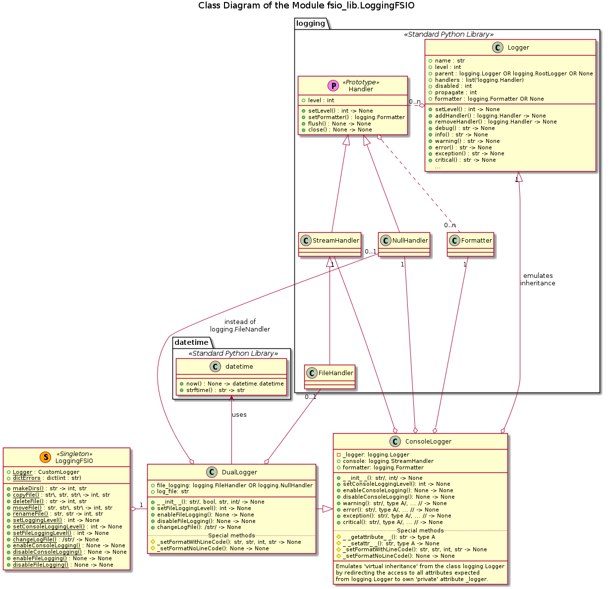
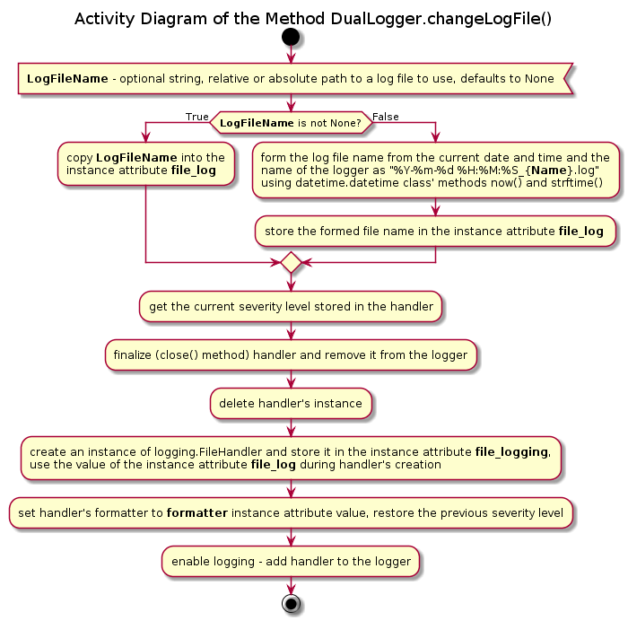

# UD001 Module LoggingFSIO Reference

## Table of Content

* [Scope](#Scope)
* [Intended Use and Functionality](#Intended-Use-and-Functionality)
* [Design and Implementation](#Design-and-Implementation)
* [API Reference](#API-Reference)
  - [Class ConsoleLogger](#Class-ConsoleLogger)
  - [Class DualLogger](#Class-DualLogger)
  - [Class LoggingFSIO](#Class-LoggingFSIO)

## Scope

This document describes the design, intended usage, implementation details and API of the module LoggingFSIO, which implements two custom loggers: to the console or to the console and / or a file (simultaneously) - and I/O exceptions free files operations, like copy, rename, move, delete file, etc.

* **ConsoleLogger**
  - **DualLogger**
* **LoggingFSIO**

## Intended Use and Functionality

This module provides *exceptions free* file operations functionality:

* creation of a folder by a given path
  - all missing *parent* folders along the path are created as well
  - if the target folder already exists, no changes occur
* copying of a file from one folder to another preserving its metadata with optional change of the base name
  - if the target file already exists it is overwritten
  - all missing folders along the path are created as well
* deletion of a file
* moving a file from one folder into another with optional change of the base name
  - as combination of copying and deleting the original file
* renaming a file
  - as the special case of the moving, when the target and source folders are the same

All **IOError** and **OSError** exceptions, which can occur during the operations, are converted into string error messages, which are retuned and, optionally, logged into the console and / or log file. This approach ensures continuous, non-interruptive (without not caught exceptions) but controllable batch file operations, like mass copy, etc.

All I/O methods return a 2-tuple of an integer error / status code and a string textual explanation as follows:

```
0 : 'Ok',
1 : 'Not a string argument:',
2 : 'Path is not found:',
3 : 'System error:',
4 : 'Failed to perform an operation without system error:'
```

It also implements an 'extension' of the functionality of the Standard Python Library **logging**. The added functionality includes:

* built-in support for and simplified interface of a dual handler logger, which can log similtaneously into two separate streams: **stdout** (console) and a file
* ability to change the log file on demand ('on the fly') from a user, not just by reaching the threshold file size (as with the standard log file rotation scheme)
* ability to completely suppresse or enable output into one or both streams without changing the logging severity level of either the logger or the handler
* well defined and verbouse structure of the issued log entries

The dynamic disabling / (re-) enabling of the logging can be easily done with the standard loggers, as follows:

1. Obtain the current logging level of the handler to be suppressed and remember it
2. Set the corresponding handler at the highest level, i.e. to no output
3. Do some stuff, where the logging is to be suppressed
4. Restore the corresponding handler to the previously remembered logging level

The added functionality of the dynamic disabling / (re-) enabling of the logger output simply eliminates the necessity of obtaining, remembering and restoration of the handler's logging level, thus reducing the task to two instance methods without parameters.

For the rest, the functionality of these custom loggers should be the same as of the standard loggers:

* Each logger has a bound logging level, which can differ from the logging level(s) of its handlers, and which can be changed dynamically
* Each handler bound to a logger has its own logging level, which may differ from the logging level of the logger itself, and which can be changed dynamically
* A log entry can be issued by calling one of the methods of the logger: **info**(), **debug**(), **warning**() or **error**()
  - If the logging level of the logger is higher than the level of the issued entry, it is simply ignored by the logger
  - Otherwise, this entry is delivered to all handlers bound to this logger
    + If the logging level of a specific handler is higher than the level of the entry, it should be ignored by this particular handler
    + Otherwise, the handler must send a corresponding message to its bound stream
* A hierarchy of the loggers, i.e. 'parent - child' relation should be supported. For instaance, if there are two logers: one with the name *SomeClassLogger*, and another - with the name *SomeClassLogger.SomeMethodLogger* - the second logger is a 'child' of the first one. A log entry issued to the 'child' logger should also be received and treated by the 'parent' logger (log entries propagation); but an entry issued to the 'parent' logger should not be visible to the 'child' logger.
  - In order to avoid the dubling of the error entries, in such situation the log entry should be handled by the 'parent' logger and not the 'child' logger, which should let it simply propagate upwards.

## Design and Implementation

Two custom logger classes are implemented: one bound to the console output (**stdout**) - ConsoleLogger - and the second class **DualLogger** can output to either a console, or to a file, or to both streams simultaneously using the same or different logging severity levels. The class **DualLogger** subclsasses the **ConsoleLogger** class, see [Illustration 1](#ill1). It also shows the *main* class LoggingFSIO.

<a id="ill1">Illustration 1</a>



Both logger classes store a reference to an actual instance of the **logging.Logger** class in a 'private' instance attribute and redirect the attribute access methods **\_\_getattribute\_\_**() and **\_\_setattr\_\_**() such, that any data attribute (field) or method implemented for the **logging.Logger** class instance is visible and accessible as an attribute of the instances of these custom loggers, see [Illustration 2](#ill2) and [Illustration 3](#ill3). So, from the user perspective they are wrapper objects for the standard logger.

<a id="ill2">Illustration 2</a>


<a id="ill3">Illustration 3</a>


With this arrangement the calls like **MyLogger.error(Message)** or **MyLogger.setLevel(Level)**, etc. become *short-cuts* (syntax sugar) for the calls **MyLogger._logger.error(Message)** or **MyLogger._logger.setLevel(Level)**, etc. respectively, assuming that **MyLogger** is an instance of either **ConsoleLogger** or **DualLogger** class.

Note that for the logging at the level WARNING and higher the **ConsoleLogger** class implements own wrapper methods **warning**(), **error**(), **exception**() and **critical**(), which temporary change the format of the log entry to 3 lines, including the code line number and module, from which the log entry is issued. Then the corresponding methods of the **logging.Logger** class are called, and the format of the log entry is reset to 2 lines. The methods **info**() and **debug**() are still redirected directly to the **logging.Logger** class within the **\_\_getattribute\_\_**() method. See [Illustration 4](#ill4).

<a id="ill4">Illustration 4</a>


These custom logger classes store a reference to an instance of **logging.Formater** class in the 'public' instance attribute. This formatter instance defines the format of each log entry, and it is applied to all handlers bound to this logger during the instantiation of the logger wrapper class, see [Illustration 5](#ill5) and [Illustration 6](#ill6). The handlers are created during the instantiation of the logger wrapper class as well, and they are stored (as references) in the public instance attributes: **console** (**stdout** handler - both classes) and **file_logging** (file output handler, only the **DualLogger** class). Note that the **file_logging** can reference either the **logging.FileHandler** (if the file logging is required / enabled) or the **logging.NullHandler** (if the file logging is suppressed). However, may be attached or not to the actual logger object depending on two factors: if that specific stream output is enabled or nor, and if this logger has a 'parent' or not. See furher in the text after the diagrams.

<a id="ill5">Illustration 5</a>


<a id="ill6">Illustration 6</a>


The custom logger clases allow dynamic enabling and disabling of the output. They also support the loggers ancestor - descendant hierarchy: the names of the loggers with the dots are supposed to indicate such relation: logger 'parent.child.grandchild' is descendant of 'parent.child', which is descendant of 'parent' logger, even if it does not exist. The actual existence of the supposed ancestors affects only the message propagation, but not the creation of a logger, which can easily be an 'orphan'.

Thus, upon the instantiation of the logger wrapper class, the console logging handler (field **console**) is always created, but it is attached to the actual logger object only if the logger object has no 'parent', i.e. the field **parent** of the logger object references an instance of **logging.RootLogger** class. See [Illustration 5](#ill5) and [Illustration 7](#ill7) for details.

<a id="ill7">Illustration 7</a>


With this arrangement the 'descendant' loggers, e.g. **SomeClassLogger.SomeMethodLogger** (as a 'child' of **SomeClassLogger**), do not have a console handler attached to them. Even if the console output has been disable and re-enabled afterwards (see [Illustration 7](#ill7)), the console handler remains not attached as long as the logger has direct a 'parent'.

_**Note**_: the dynamic disabling of the console logging is performed via the instance method **disableConsoleLogging**(), which simply removes the console handler from the list of the active handlers of the logging object using the method **logging.Logger.removeHandler**(). This **removeHandler**() is intelligent enough to ignore the handlers passed as the argument, which are not registered as active handlers of this logger object.

This approach ensures, that there is no 'dubbling' of the console log entries; a log entry issued to a 'child' logger is printed out only by the 'root' logger (at the top of the hierarchy). The dynamic enabling / disabling of the *console* logging has an effect only on the 'root' logger of the hierarchy and affects all its descendant; whereas enabling / disabling of the console logging of a descendant logger has no effect at all, because they console handlers are never attached.

With the *file output handler* another approach is taken, see [Illustration 6](#ill6), [Illustration 8](#ill8) and [Illustration 9](#ill9).

<a id="ill8">Illustration 8</a>


Upon instantiation of the **DualLogger** class either an instance of the **logging.FileHandler** or an instance of the **logging.NullHandler** class is referenced by the instance attribute **file_logging** and is attached to the actual logger object, depending on if the file logging must be enabled or disabled. When the file logging is explicitely (re-) enabled (see [Illustration 7](#ill7)) the instance of the **logging.NullHandler** class referenced by the **file_logging** attribute (if this is the case) is replaced by an instance of the **logging.FileHandler** class (also in the list of the active handlers of the actual logger object). Otherwise, if the **file_logging** attribute references an isntance of the **logging.FileHandler** class already, this handler is simply re-attached to the logger object.

When the file logging is disabled at the 'run-time', the handler referenced by the attribute **file_logging** is detached from the logger object only if it is an intance of the **logging.FileHandler** class, since the **logging.NullHandler** class does not output any log entries anyway, see [Illustration 9](#ill9).

<a id="ill9">Illustration 9</a>


The file logging can be enabled / disabled for each of the logger in the hierarchy independently, since the expected '*modus operandi*' is that each instance of the **DualLogger** class uses own file to log in. It is convenient that each 'child' logger maintains own log file, where specific events are registered, for instance, originating from a specific class / method or function, whereas the 'parent' logger aggregates all relevant events in a single log file.

Finally, the log file can be changed at any time using the instance method **changeLogFile**(), see [Illustration 10](#ill10). As in the case of the instantiation, the desired name of the file can be passed as the optional argument; otherwise the file name is constructed automatically form the current date-time stamp and the name assigned to the logger object.

<a id="ill10">Illustration 10</a>



The class **LoggingFSIO** is implemented as a *Singleton*: all its methods are *class methods*; therefore, it can be used without instantiation. Its I/O methods wrap the calls to the Standard Python Library I/O functions in **try:...except (IOError, OSError):** construct and transforms the raised I/O related exceptions into the error codes (integer) and messages (string), which are returned and, optionally, logged into the console and / or log file. In order to implement logging, an instance of the **DualLogger** class is referenced by a 'private' class data attribute (field). It also performs sanity checks on the arguments passed to its I/O methods.

The method **makeDirs**(), see [Illustration 11](#ill11), attempts to create all missing (sub-) folders down to the target one, unless it already exists. The functional logic of this method is:

* Input argument (path) is not a string -> **ERROR** message + no chages in the file system
* Target folder already exists -> **DEBUG** message + no chages in the file system
* **IOError** or **OSError** is raised -> **ERROR** message + file system may be changed
* No I/O related exceptions but the target folder is not created -> **ERROR** message + file system may be changed
* Target folder is created -> **INFO** message + the desired change to the file system is applied

<a id="ill11">Illustration 11</a>


The method **copyFile**(), see [Illustration 12](#ill12), attempts to copy a file from the source folder into the target folder preserving its metadata. It is possible to change the base name (rename) of the file as well. The source and the target folders can also be the same. The functional logic of this method is:

* Source path argument is not a string -> **ERROR** message + no changes to the file system
* Source path argument does not references a file -> **ERROR** message + no changes to the file system
* Neither target folder nor the new base name of the file are provided (both are None) -> **ERROR** message + no changes to the file system
* Target folder argument is neither None nor a string -> **ERROR** message + no changes to the file system
* New base name argument is neither None nor a string -> **ERROR** message + no changes to the file system
* If target folder argument is provided (string) -> create all missing (sub-) folders along this path using **makeDirs**() method
  - if failed -> **ERROR** message + possible changes in the files structure
* If the target folder is not provided (None) -> use the source folder as the target
* If the new base name is provided (string) form the targer path as the target folder + new base name; otherwise as the target folder + old base name
  - If the source and the target files are exactly the same -> **WARNING** message + no changes in the file system
* Try to copy the file from the source path to the target path preserving the metadata; existing file is overwritten
* **IOError** or **OSError** is raised -> **ERROR** message + file system may be changed
* No I/O related exceptions but the target file is not found -> **ERROR** message + file system may be changed
* Target file is found -> **INFO** message + the desired change to the file system is applied

<a id="ill12">Illustration 12</a>


The method **deleteFile**(), see [Illustration 13](#ill13), attempts to delete a file by the provided path to it. The functional logic of this method is:

* Target path argument is not a string -> **ERROR** message + no changes to the file system
* Target file does not exist -> **ERROR** message + no changes to the file system
* Try to delete the file
* **IOError** or **OSError** is raised -> **ERROR** message + file system is not changed
* Target file still exists -> **ERROR** message + file system is not changed
* Target file is deleted -> **INFO** message + the desired change to the file system is applied

<a id="ill13">Illustration 13</a>


The method **moveFile**(), see [Illustration 14](#ill14), attempts to move a file specified by the source path to a new location specified by the target folder and / or new base name by first copying the original file into the new location (preserving the metadata) and then deleting the original file. If the new base name is provided, and it is not the same as the original base name, the file is also renamed. Thus, the functional logic of this method combines those of the methods **copyFile**() and **deleteFile**(), except that the target path has to be specified always (cannot be None):

* Source path argument is not a string -> **ERROR** message + no changes to the file system
* Source path argument does not references a file -> **ERROR** message + no changes to the file system
* Target folder argument is not a string -> **ERROR** message + no changes to the file system
* New base name argument is neither None nor a string -> **ERROR** message + no changes to the file system
* If the new base name is provided (string) form the targer path as the target folder + new base name; otherwise as the target folder + old base name
  - If the source and the target files are exactly the same -> **WARNING** message + no changes in the file system
* Try to copy the file from the source path to the target path using the **copyFile**() method
* The **copyFile**() method returns an error -> **ERROR** message + file system may be changed
* No errors ('Ok' status 0 is returned) -> the new file is created + **DEBUG** message
  - Delete the original file using **deleteFile**() method
  - No errors ('Ok' status 0 is returned) -> the original file is deleted + **DEBUG** message
  - Any error status + message are returned -> **ERROR** mesage + the original file is not deleted

<a id="ill14">Illustration 14</a>


Finally, the  method **renameFile**(), see [Illustration 15](#ill15), attempts to rename a file specified by the source path by giving it a new base name, whilst it remains in the original source folder. Basically, it is a special case of the **moveFile**() method, with the target and source folders being the same. Its finctional logic is:

* Source path argument is not a string -> **ERROR** message + no changes to the file system
* Source path argument does not references a file -> **ERROR** message + no changes to the file system
* New base name argument is not a string -> **ERROR** message + no changes to the file system
* New base name argument is not a proper base name of a file -> **ERROR** message + no changes to the file system
* Extract the source folder from the source path -> use it as the target folder for the **moveFile**() method
* No errors ('Ok' status 0 is returned) -> the file is renamed + **DEBUG** message
* Any error status + message are returned -> **ERROR** mesage + either no changes to the file system, or the 'renamed' file is created but the original is not deleted

<a id="ill15">Illustration 15</a>


All I/O methods but **makeDirs**() results in the sanity checks being performed at least twice: in the method itself and in another I/O method it calls. This approach increases the amount of the overhead, since some checks on the same data are performed more than once with the already known positive outcome. However, this approach has an advantage, that the obvious problems, like the improper input arguments, is caught as soon as possible. The benfits are:

* minimalization of the changes introduced to the file system in the case of a failed operation
* easier 'debugging' / tracing of the problem using the generated log messages

For instance, the **moveFile**() method is called with proper target folder (path to it), which does not exist yet, but with improper source path (e.g., not a string, or not existing file). Basically, the normal call chain is **moveFile**() --> **copyFile**() + **deleteFile**() => (**copyFile**() --> **makeDirs**()) + **deleteFile**(). If each method performs only the sanity checks, which it cannot delegate to the other method it calls, and performs the said checks only before the critical operation, it is possible to discover the improper source path only after the creation of all missing folders along the target folder path. So, some empty (sub-) folders can be created, whereas the file will not be moved at all. Furthermore, in such a case the error message will be issued by the **copyFile**() method, not the **moveFile**() method, which can be confusing while tracking the source of the error.

With the employed strategy the obvious input faults are caught and reported by the first method in the call chain, i.e. **moveFile**() and not **copyFile**() as in the example above. Still, some I/O related errors, e.g. locked file, etc., can occur within and be logged by the 'inner' method (further along the call chain), but in such a situation all methods on the way back up will add **ERROR** messages with the comments on the impact on the desired operation result. Finally, the last **ERROR** message is always issued by the first method in the call chain.

The class **LoggingFSIO** also implements a set of *wrapper* _**class methods**_ as syntax sugar / short-cuts to the _**instance methods**_ of its 'private' attribute **_Logger**, which is an instance of the **DualLogger** class:

* **setLoggingLevel**() => DualLogger.setLevel() => ConsoleLogger.setLevel() => ConsoleLogger._logger.setLevel() => logging.Logger.setLevel()
* **setConsoleLoggingLevel**() => DualLogger.setConsoleLoggingLevel() => ConsoleLogger.setConsoleLoggingLevel() => ConsoleLogger.console.setLevel() => logging.Handler.setLevel()
* **setFileLoggingLevel**() => DualLogger.setFileLoggingLevel() => DualLogger.file_logger.setLevel() => logging.Handler.setLevel()
* **enableConsoleLogging**() => DualLogger.enableConsoleLogging() => ConsoleLogger.enableConsoleLogging()
* **disableConsoleLogging**() => DualLogger.disableConsoleLogging() => ConsoleLogger.disableConsoleLogging()
* **enableFileLogging**() => DualLogger.enableFileLogging()
* **disableFileLogging**() => DualLogger.disableFileLogging()
* **changeLogFile**() => DualLogger.changeLogFile()

### Warning

Due to the implementation of the 'virtual inheritance' the behavior of the function **logging.getLogger**() may be confusing. Suppose, that the class **ConsoleLogger** is instantiated as **MyLoggger = ConsoleLogger**('LoggerMy'). The call **logging.getLogger**('MyLogger') will return the reference to an instance of **logging.Logger** class, namely the value of **MyLogger._logger**, and not the instance **MyLogger** itself.

The default settings for the logging by the **LoggingFSIO** class are:

* The overal logging severity level (of the logger) is **logging.DEBUG**
* The logging severity level of the console handler is **logging.INFO** and the console logging is enabled
* The logging severity level of the file handler is **logging.WARNING** and the file logging is disabled
* The default base name of the log file is "{YYYY}-{MM}-{DD} {HH}\_{mm}\_{ss}\_LoggingFSIO.log", where values in {} are palceholders for the date and time stamp parts, e.g. "2018-10-18 09\_41\_10\_LoggingFSIO.log"; and the file is created in the current working directory when file logging is enabled even if no log entries were issued.

This default behaviour can be changed using the *wrapper* methods of the **LoggingFSIO** class at any moment.

## API Reference

### Class ConsoleLogger

Custom logger class implementing logging into the console, which can be suppressed or re-enabled dynamically.

Note that due to the support of the loggers ancestor - descendant hierarchy the names of the loggers with the dots are supposed to indicate such relation: logger 'parent.child.grandchild' is descendant of 'parent.child', which is descendant of 'parent' logger, even if it does not exist. The actual existence of the supposed ancestors affects only the message propagation, but not the creation of a logger, which can easily be 'orphan'.

The dynamic enabling / disabling of the console logging has an effect only on the 'root' logger of the hierarchy and affects all its descendant; whereas enabling / disabling of the console logging of a descendant logger has no effect at all.

By default, the logger event logging level is set to logging.DEBUG, but it can be changed at any moment using inherited method setLevel() as well as during the instantiation. The logging into console is enabled at the level logging.<span></span>INFO. The console logging level can be changed, as well as the console logging may be entirely suppressed and then re-enabled.

Any class instance has a hidden 'dummy' handler of NullHandler class, thus the real console logging handler can be disabled without complains from the logging module.

The default format is:

* For the level below WARNING - 2 lines:
  - logging level, date and time in ASCII format, name of the module, name of the logger (not its class), name of the calling function
  - actual message sent the logger
* For the level of WARNING and above - 3 lines:
  - logging level, date and time in ASCII format, name of the module, name of the logger (not its class), name of the calling function
  - line number within and the path to the module, where the logging entry is issued
  - actual message sent the logger

Virtually 'inherits' all API from the class logging.Logger by attribute resolution redirection, and adds new data fields and methods.

#### Instance Data Attributes (Fields)

* **console**: logging.StreamHandler, instance of, can be used for the direct access to the console logger handler
* **formatter**: logging.Formatter, instance of can be used for the changing of the log entries format

#### Initialization

**\_\_init\_\_**(strName, level = logging.DEBUG)

Signature:

str/, int/ -> None

Args:

* *strName*: string, the name of the logger to be created; it will be displayed as a part of the log entries, and it determines the loggers hierarchy (ancestor - descendant)
* *level*: (optional) non-negative integer, the logging level, e.g. logging.DEBUG, logging.WARNING, etc.

Description:

Sets the logger instance name and logging level.

Note that due to the support of the loggers ancestor - descendant hierarchy the names with the dots are supposed to indicate such relation as logger 'parent.child.grandchild' is descendant of 'parent.child', which is descendant of 'parent' logger, even if it does not exist.

#### Instance Methods

**enableConsoleLogging**()

Signature:

None -> None

Description:

Method to enable logging into the console.

The dynamic enabling / disabling of the console logging has an effect only on the 'root' logger of the hierarchy and affects all its descendant; it has no effect at all on a descendant logger.

**disableConsoleLogging**()

Signature:

None -> None

Description:

Method to disable logging into the console.

The dynamic enabling / disabling of the console logging has an effect only on the 'root' logger of the hierarchy and affects all its descendant; it has no effect at all on a descendant logger.

**setConsoleLoggingLevel**(level)

Signature:

int -> None

Args:

* *level*: non-negative integer, the logging level, e.g. logging.DEBUG, logging.WARNING, etc.

Description:

Method to change the logging level of the handler for the logging into the console. Basically, an alias for **self.console.setLevel**(level).

**setLevel**(level)

Signature:

int -> None

Args:

* *level*: non-negative integer, the logging level, e.g. logging.DEBUG, logging.WARNING, etc.

Description:

Method to change the logging level of the logger. Basically, an alias for **self._Logger.setLevel**(level).

**debug**(strMessage)

Signature:

str -> None

Args:

* *strMessage*: str, the message to log (before the formatting) - will form the last line of the actual log entry

Description:

Method to issue a log entry at DEBUG level. Alias for **self._Logger.debug**().

**info**(strMessage)

Signature:

str -> None

Args:

* *strMessage*: str, the message to log (before the formatting) - will form the last line of the actual log entry

Description:

Method to issue a log entry at INFO level. Alias for **self._Logger.info**().

**warning**(strMessage)

Signature:

str -> None

Args:

* *strMessage*: str, the message to log (before the formatting) - will form the last line of the actual log entry

Description:

Method to issue a log entry at WARNING level. Alias for **self._Logger.warning**(). Note, that the message is formed as the 3 lines, the module and line number of the issuer is added as the second line.

**error**(strMessage)

Signature:

str -> None

Args:

* *strMessage*: str, the message to log (before the formatting) - will form the last line of the actual log entry

Description:

Method to issue a log entry at ERROR level. Alias for **self._Logger.error**(). Note, that the message is formed as the 3 lines, the module and line number of the issuer is added as the second line.

**critical**(strMessage)

Signature:

str -> None

Args:

* *strMessage*: str, the message to log (before the formatting) - will form the last line of the actual log entry

Description:

Method to issue a log entry at CRITICAL level. Alias for **self._Logger.critical**(). Note, that the message is formed as the 3 lines, the module and line number of the issuer is added as the second line.

### Class DualLogger

Custom logger class implementing logging into the console and / or into a file, which can be suppressed or re-enabled dynamically.

Note that due to the support of the loggers ancestor - descendant hierarchy the names of the loggers with the dots are supposed to indicate such relation: logger 'parent.child.grandchild' is descendant of 'parent.child', which is descendant of 'parent' logger, even if it does not exist. The actual existence of the supposed ancestors affects only the message propagation, but not the creation of a logger, which can easily be 'orphan'.

The dynamic enabling / disabling of the console logging has an effect only on the 'root' logger of the hierarchy and affects all its descendant; whereas enabling / disabling of the console logging of a descendant logger has no effect at all. The file logging can be enabled / disabled for each of the logger in the hierarchy independently.

By default, the logger event logging level is set to logging.DEBUG, but it can be changed at any moment using inherited method setLevel() as well as during the instantiation. The logging into console is enabled at the level logging.<span></span>INFO. The console logging level can be changed, as well as the console logging may be entirely suppressed and then re-enabled.

The logging into a file is disabled initially unless explicitly asked otherwise during the instantiation, whilst the default file logging level is set to logging.WARNING. If the name of the log file to be used is not specified, its created automatically by the date and time of instantiation and the logger instance name, even if the file logging is disabled.

Implementation details:

* has a hidden 'dummy' handler of NullHandler class, thus the both real handlers can be disabled without complains from the logging functionality
* actual log file is not created / re-opened until the file logging is enabled implicitly (or by setting the flag to True during the instantiation)
* call to the method changeLogFile() automatically enables the file logging, thus log file is created / re-opened
* the log files are created / re-opened in the 'w' mode, thus clearing their previous content, but disabling / suppressing of the file logging doesn't actually closes the log file, therefore the reenabling of the file logging doesn't delete the previously made entries

The default format is:

* For the level below WARNING - 2 lines:
  - logging level, date and time in ASCII format, name of the module, name of the logger (not its class), name of the calling function
  - actual message sent the logger
* For the level of WARNING and above - 3 lines:
  - logging level, date and time in ASCII format, name of the module, name of the logger (not its class), name of the calling function
  - line number within and the path to the module, where the logging entry is issued
  - actual message sent the logger

Virtually 'inherits' all API from the class logging.Logger by attribute resolution redirection via its direct super class **ConsoleLogger**, and adds new data fields and methods.

#### Instance Data Attributes (Fields)

* **console**: logging.StreamHandler, instance of, can be used for the direct access to the console logger handler
* **formatter**: logging.Formatter, instance of can be used for the changing of the log entries format
* **file_logging**: logging.FileHandler OR logging.NullHandler, instance of, can be used for the direct access to the file logger handler

#### Initialization

**\_\_init\_\_**(strName, bLogToFile = False, strFileName = None, level = logging.DEBUG)

Signature:

str/, bool, str, int/ -> None

Args:

* *strName*: string, the name of the logger to be created; it will be displayed as a part of the log entries, and it determines the loggers hierarchy (ancestor - descendant)
* *bLogToFile*: (optional) boolean flag, if the file logging is to be initially enabled
* *strFileName*: (optional) string, filename to be used for the log file if the file logging is enabled
* *level*: (optional) non-negative integer, the logging level, e.g. logging.DEBUG, logging.WARNING, etc.

Description:

Sets the logger instance name, logging level and log file (even if the logging into a file is suppressed).

Note that due to the support of the loggers ancestor - descendant hierarchy the names with the dots are supposed to indicate such relation as logger 'parent.child.grandchild' is descendant of 'parent.child', which is descendant of 'parent' logger, even if it does not exist.

If optional file name is not passed during instantiation of the class, it is defined automatically from the current date and time as well as the 'name' of the logger instance with the extension '.log'. Otherwise, the file name passed during instantiation of the class is remembered with the standard convention on absolute / relative to the current working directory path being applied.

Note that the log file is not created / opened immediately if the second (optional) argument - boolean flag - is False, i.e. the logging into a file is suppressed. However, if the file logging s enabled, the actual log file is created or re-opened in 'w' mode using the filename passed into this method or automatically defined during the instantiation.

#### Instance Methods - Added

**enableFileLogging**()

Signature:

None -> None

Descriptions:

Method to enable logging into a file. If the logging into the file was not enabled upon instantiation of the class, a log file is created  otherwise the existing log file is 're-used'.

If optional file name is not passed during instantiation of the class, it is defined automatically from the date and time of instantiation as well as the 'name' of the logger instance with the extension '.log'. Otherwise, the file name passed during instantiation of the class is used with the standard convention on absolute / relative to the current working directory path being applied.

Note that the file logging can be enabled / disabled for each of the logger in the hierarchy independently.

**disableFileLogging**()

Signature:

None -> None

Description:

Method to disable logging into a file. Note that the active log file is not actually closed, its handler is simply removed from the list of handlers. Therefore, is the file logging is re-enabled later, the already made log entries are not removed.

Note that the file logging can be enabled / disabled for each of the logger in the hierarchy independently.

**setFileLoggingLevel**(level)

Signature:

int -> None

Args:

* *level*: non-negative integer, the logging level, e.g. logging.DEBUG, logging.WARNING, etc.

Description:

Method to change the logging level of the handler for the logging into a file. Basically, an alias for **self.file_logging.setLevel**(level).

**changeLogFile**(strFileName = None)

Signature:

/str/ -> None

Args:

* *strFileName*: (optional) string, or any type convertible to a string, the filename of a log file to switch to; the standard convention on absolute / relative to the current working directory path is applied.

Description:

Method to change the active log file. If logging to a file was disabled this method automatically enables it. Otherwise, the log file used before is closed, and the new log file is created.

If optional file name is not passed, it is defined automatically from the current date and time as well as the 'name' of the logger instance with the extension '.log'. Note that in this case the log file is created in the current working directory.

#### Instance Methods - Inhertited

**enableConsoleLogging**()

Signature:

None -> None

**disableConsoleLogging**()

Signature:

None -> None

**setConsoleLoggingLevel**(level)

Signature:

int -> None


**setLevel**(level)

Signature:

int -> None

**debug**(strMessage)

Signature:

str -> None

**info**(strMessage)

Signature:

str -> None

**warning**(strMessage)

Signature:

str -> None

**error**(strMessage)

Signature:

str -> None

**critical**(strMessage)

Signature:

str -> None

### Class LoggingFSIO

Implements 'safe/smart' copy / move / rename / delete file operations, which intercept OS and I/O related exceptions raised during operations, which are logged into console and / or file and returned as the result of the operation. Also the file copy / move / rename operation preserves the file's metadata, like created date, etc.

Designed to be used as a Singleton, thus it doesn't require instantiation, and all implemented methods are class methods.

All methods perform input data sanity checks and intercept the raised **IOError** and **OSError** exceptions, which are converted into string error messages. This approach ensures continuous, non-interruptive (without not caught exceptions) but controllable batch file operations, like mass copy, etc. All methods return a 2-tuple of an integer error / status code and a string textual explanation as follows:

```
0 : 'Ok',
1 : 'Not a string argument:',
2 : 'Path is not found:',
3 : 'System error:',
4 : 'Failed to perform an operation without system error:'
```

The exit code > 0 is an error situation, in which case the string explanation is normally extended with the details of the error, e.g., with which file or folder there is a problem, or the details of the raised and caught exception.

In addition, all methods log the progress of the work flow and the encountered problems at different severity levels:

* **DEBUG** - normal work flow along the paths, which do not change the state of the file system
* **INFO** - normal work flow along the paths, which result in creation of files or folders or deletion of files
* **WARNING** - not true errors and part of the normal work flow, but the result may differ from the user's expectations, e.g., refused copy operation of a file onto itself
* **ERROR** - actual errors, interrupted work flow, including failed input data sanity checks and raised and caught exceptions

**N.B.** the default logger referenced by a 'private' class field _Logger is an instance of the DualLogger class, which includes the handlers for the console logging (enabled by default at **INFO** severity level) and for the logging into a file (by default set at **WARNING** severity level and disabled), whereas the logger itself is set at **DEBUG** level.

#### Class Methods

**makeDirs**(strFolder)

Signature:

str -> int, str

Args:

* *strFilePath*: str, relative or absolute path to a file to be deleted

Returns:

* tuple(int, str): an unpacked tuple of an integer (error code, 0 is Ok) and a string (textual description of an error).

Description:

Method to create recursively (all nested levels) a folder specified by relative or absolute path passed as the argument. If this end leaf folder already exists, the method simply return the success status (error code 0) with the corresponding string message.

Relies upon the Standard Python Library function **os.makedirs**(). If this folder cannot be created due to permission limitations, the normally raised **OSError** or **IOError** exceptions are intercepted and converted into the string textual explanation, which is returned together with the error code 3.

Logs the work flow and encountered errors / exceptions using the class' logger.

**copyFile**(strSourceFilePath, strTargetFolder = None, strNewBaseName = None )

Signature:

str\, str, str\ -> int, str

Args:

* *strSourceFilePath*: str, relative or absolute path to a file to be copied
* *strTargetFolder*: (optional) str, relative or absolute path to the target folder; if not specified (or the default value None is passed), the current location (folder) of the file to be copied is used as the target folder as well, in this case the new base name must differ from the current base name of the file, otherwise the file will not be copied upon itself
* *strNewBaseName*: (optional) str, new base name of the file; N.B. this string should not contain any folders, only the base name (with the extension if required); if this attribute is not passed (or default None value is passed) the file is simply moved into the new folder without change of its base name. Note: both the *strTargetFolder* and *strNewBaseName* arguments cannot be **None** simultaneously; such case is treated as an error with the return code 1.

Returns:

* tuple(int, str): an unpacked tuple of an integer (error code, 0 is Ok) and a string (textual description of an error).

Description:

Method to copy a file into a new folder with the optional renaming of the created copy. Three major modes of operation are available depending on the passed (optional) arguments for the new location (folder) and the new base file name:

* new location (folder) is provided and different from the current one, and the new base name is provided and different from the current one - the file is copied into a new folder and the copy is renamed
* new location (folder) is provided and different from the current one, and the new base name is not provided or is the same as the current one - the file is copied into a new folder with the same base name
* new location (folder) is not provided or is the same as the current one, and the new base name is provided and different from the current one - a new copy of the file with a diffent base name is created in the same (source) folder

Relies upon the Standard Python Library function **shutil.copy2**(), which preserves the file's metadata. If this file cannot be copied into the specified destination due to permission limitations, the normally raised **OSError** or **IOError** exceptions are intercepted and converted into the string textual explanation, which is returned together with the error code 3.

Existing file in the target folder is overwritten.

Logs the work flow and encountered errors / exceptions using the class' logger.

**deleteFile**(strFilePath)

Signature:

str -> int, str

Args:

* *strFilePath*: str, relative or absolute path to a file to be deleted

Returns:

* tuple(int, str): an unpacked tuple of an integer (error code, 0 is Ok) and a string (textual description of an error).

Description:

Method to delete a file specified by relative or absolute path passed as the argument.

Relies upon the Standard Python Library function **os.remove**(). If file cannot be deleted due to permission limitations, the normally raised **OSError** or **IOError** exceptions are intercepted and converted into the string textual explanation, which is returned together with the error code 3.

Logs the work flow and encountered errors / exceptions using the class' logger.

**moveFile**(strSourceFilePath, strTargetFolder, strNewBaseName = None)

Signature:

str, str\, str\ -> int, str

Args:

* strSourceFilePath: str, relative or absolute path to a file to be renamed
* strTargetFolder: str, relative or absolute path to the target folder
* strNewBaseName: (optional) str, new base name of the file; N.B. this string should not contain any folders, only the base name (with extension if required); if this attribute is not passed (or default None value is passed) the file is simply moved into the new folder without change of its base name

Returns:

* tuple(int, str): an unpacked tuple of an integer (error code, 0 is Ok) and a string (textual description of an error).

Description:

Method to move a file specified by relative or absolute path as the first argument into another folder specified as relative or absolute path and, optionally, change its base name into a new one provided as the third (keyword, optional) argument.

Note that if the target folder is the same as the current folder of the file to be moved, the new base name must be provided - in this case the file is renamed, see also class method renameFile() - otherwise the requested operation is ignored.

If the new base name is not provided (or the default None value is given), the base name of the file is not changed, only its location.

The original file is, at first, copied into a new location with optional change of its base name. Only if copying operation is successful, the original file is deleted. Thus, due to file permissions it is possible that a new file is created but the original one is not deleted.

Existing file in the target folder is overwritten.

Wraps the class methods **copyFile**() and **deleteFile**().

Logs the work flow and encountered errors / exceptions using the class' logger.

**renameFile**(strSourceFilePath, strNewBaseName)

Signature:

str, str -> int, str

Args:

* strSourceFilePath: str, relative or absolute path to a file to be renamed
* strNewBaseName: str, new base name of the file; N.B. this string should not contain any folders, only the base name (with extension if required)

Returns:

* tuple(int, str): an unpacked tuple of an integer (error code, 0 is Ok) and a string (textual description of an error).

Description:

Method to rename a file specified by relative or absolute path as the first argument, i.e. to change its base name to a new value given as the second argument without relocation (file remains in its original folder).

Wraps the class method **moveFile**().

Logs the work flow and encountered errors / exceptions using the class' logger.

**setLoggingLevel**(iLevel)

Signature:

int -> None

Args:

* iLevel: non-negative integer, the logging level, e.g. **logging.DEBUG**, **logging.WARNING**, etc

Description:

Sets the overal logging level of the bound logger object. Wrapper for **ConsoleLogger.setLevel**() method, which is, actually, the 'short-cut' for **logging.Logger.setLevel**() method.

**setConsoleLoggingLevel**(iLevel)

Signature:

int -> None

Args:

* iLevel: non-negative integer, the logging level, e.g. **logging.DEBUG**, **logging.WARNING**, etc

Description:

Sets the logging level into the file of the bound logger object. Wrapper for **ConsoleLogger.setConsoleLoggingLevel**() method.

**setFileLoggingLevel**(iLevel)

Signature:

int -> None

Args:

* iLevel: non-negative integer, the logging level, e.g. **logging.DEBUG**, **logging.WARNING**, etc

Description:

Sets the logging level into the file of the bound logger object. Wrapper for **DualLogger.setFileLoggingLevel**() method.

**changeLogFile**(strFileName = None)

Signature:

/str/ -> None

Args:

* strFileName: (optional) string, or any type convertible to a string, the filename of a log file to switch to; the standard convention on absolute / relative to the current working directory path is applied.

Description:

Method to change the active log file. If logging to a file was disabled this method automatically enables it. Otherwise, the log file used before is closed, and the new log file is created.

If optional file name is not passed, it is defined automatically from the current date and time as well as the 'name' of the logger instance with the extension '.log'. Note that in this case the log file is created in the current working directory.

Wraps the **DualLogger.changeLogFile**() method.

**enableConsoleLogging**()

Signature:

None -> None

Description:

Method to enable logging into the console.

Wraps the **ConsoleLogger.enableConsoleLogging**() method.

**disableConsoleLogging**()

Signature:

None -> None

Description:

Method to disable logging into the console.

Wraps the **ConsoleLogger.disableConsoleLogging**() method.

**enableFileLogging**()

Signature:

None -> None

Description:

Method to enable logging into a file. If the logging into the file was not enabled upon instantiation of the class, a log file is created; otherwise the existing log file is 're-used'.

If optional file name is not passed during instantiation of the class, it is defined automatically from the date and time of instantiation as well as the 'name' of the logger instance with the extension '.log'. Otherwise, the file name passed during instantiation of the class is
 used with the standard convention on absolute / relative to the current working directory path being applied.

Wraps the **DualLogger.enableFileLogging**() method.

**disableFileLogging**()

Signature:

None -> None

Description:

Method to disable logging into a file. Note that the active log file is not actually closed, its handler is simply removed from the list of handlers. Therefore, is the file logging is re-enabled later, the already made log entries are not removed.

Wraps the **DualLogger.disableFileLogging**() method.