# UD002 Reference on the Module fsio_lib.StructureMapping

## Table of Content

* [Scope](#Scope)
* [Intended Functionality and Use](#Intended-Functionality-and-Use)
* [Design and Implementation](#Design-and-Implementation)
* [Usage](#Usage)
* [API Reference](#API-Reference)

## Scope

This document describes the design, intended usage, implementation details and API of the module StructureMapping, which implements a number of functions for parsing the mapping definitions stored in JSON files and application of the object to object content mapping according to the specifications given in [DE001 document](./DE001_Mapping_DSL_Specification.md):

* **FlattenPath**()
* **ResolvePathSubstitutions**()
* **GetElement**()
* **SetElement**()
* **DeleteElement**()
* **AddElement**()
* **LoadDefinition**()
* **MapValues**()

## Intended Functionality and Use

The purpose of this module is to provide an effective and simple manner of data storage format transformation, in terms of mapping of elements structure of one nested data object onto another, i.e. rules of from which (nested) elements of an object A the values are to be read and to which (nested) elements of an object B they must be assigned. This a typical situation in data processing.

For example, consider a hypothetical library, where a generic and extendible model of the measurements (and post-processing of the data) is implemented, concerning devices with different amount of detectors and / or actuators. The model is a class with deep nesting of the data attributes, which structure is generated dynamically depending of the configuration of a specific device.

It is not difficult to implement *data serialization* methods (like **pickle**() / **unpickle**()) even in the case of extendible internal structure of such object, but only if the format of the data storage has a fixed structure (with variable amount of content). In reality, however, the data measured by the devices can be stored using numerous formats: XML and JSON of varying internal structure, and even tabulated data (TSV format) with the various amount and order of the columns. Basically, for each variant of the data storage file format a specific parser is required, with the own set of the mapping rules. To complicate the matter further, the JSON files are normally converted into dictionaries upon reading from the file, whereas the the XML files - into xml.etree.ElementTree objects, and TSV files - into nested lists. These three types of the data storage objects have very different structure and elements access methods.

The main idea behind this module is to be able to write a *generic* parser, which can read the data from the file and assing the corresponding values to the required (nested) elements of an object, which will be used for the further data processing, using a *template* / *data mapping rules* specific for this combination of the data file format / internal structure and the structure of the object to store / process the data. So, instead of writting a new parser function / method for each case one can simply define a set of rules using a DSL, for instance as defined in [DE001 document](./DE001_Mapping_DSL_Specification.md), which also allows re-use of other mapping rules with the incremental changes, e.g. addition or deletion of the specific rules.

The advantages of this approach are:

* Easier understanding of the mapping rules based on the analysis of the mapping rules compared to the analysis of the source code
* Easier and safer manipulation of the mapping rules, for instance, due to the changes in the data file format between the releases of the corresponding data generating software: re-use of the older definitions with the incremental changes - instead of rewriting the entire function / method or inclusion additional work flow paths
* Separation of the programming logic and configuration data

The typical intended use case following this approach is given in [Illustration 1](#ill1).

<a id="ill1">Illustration 1</a>

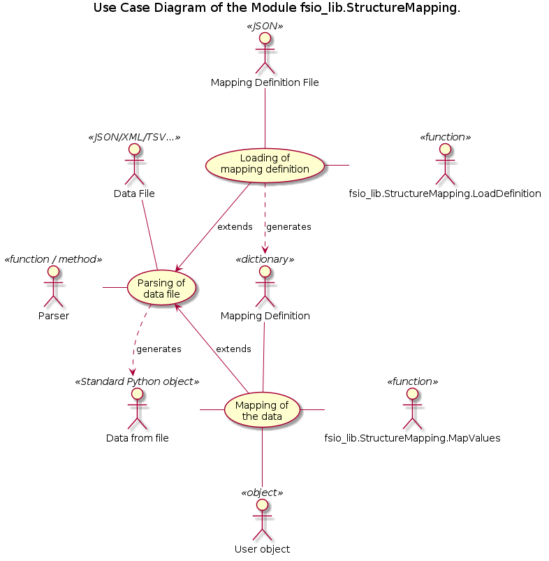

It shows only the two 'main' functions, which work flow relies on a set of the 'helper' functions implementing input data sanity checks and 'universal' access to the nested elements of the majority of the commonly used container data types:

* *Sequences*: in general, **collections.Sequence** (excluding strings); practical examples - **list**, **tuple**, etc.
* *Mapping types*: in general, **collections.Mapping**; practical example - **dict**
* *XML representaton*: specifically, **xml.etree.ElementTree.Element** - as an XML node
* *Generic structured objects with dot notation attributes access*

For instance,

* An *attribute* of an object is accessible by its "Name" (string, even stricter - a proper Python identifier) as Object.<span />Name -the dot notation - or using **getattr**(Object, "Name") / **setattr**(Object, "Name", Value) functions
* An entry in a dictionary (key : value pair) is accessible by the Name of its key using Dict\["Name"\] notation or using Dict.**get**("Name") / Dict.**set**("Name", Value) methods
* An element of a sequence is accessingle by its Index (integer number) as Seq\[Index\]
* In the case of an XML node:
  - 'Special' attributes: 'tag', 'text' and 'tail' - are accessible using the dot notation, e.g. Node.tail
  - 'Normal' attributes - using the dictionary methods applied to its property *attrib*, e.g. Node.**attrib**\["Name"\]; or using methods Node.**set**() and Node.**get**()
  - Sub-elements (nested nodes) are accessible by their index, e.g. Node\[1\] - the second sub-element attached to this node - or by its "Name" (tag of the sub-elememt) using Node.**find**("Name")

The access helper function hide these differences, and provide unified access to an arbitrary level deep nested element using a *path* definition constructed according to the [DE001 document DSL](./DE001_Mapping_DSL_Specification.md) after 'flattening' it to a plain list and application of the *path and value substitutions*:

* Each element in the path referes to a single level of the data nesting
* String elements are the names of the keys / attributes / elements - applicable to generic struct-like objects, dictionaries and XML nodes. In the case of an XML node the resolution by name order is:
  - special attributes
  - sub-elements (by their tags)
  - normal attributes
* Non-negative integer number elements are the indexes, which are applicable only for the sequence objects and XML nodes; in the last case the indexes of the attached sub-elements are concerned
* 'Choice' dictionary elements are replacement for an index, when it is unknown:
  - each key must be a string
  - each value must be a string, a numeric value or a boolean value
  - all elements in the sequence / sub-elements of the node are checked until all are checked or the first proper element is found, which:
    + has all the required keys / attributes
    + they all have the required values

All 'missing element' related exceptions: **IndexError**, **KeyError** and **AttributeError** - are converted into **AttributeError** exceptions. **TypeError** and **ValueError** exceptions can be raised if the path definition does not satisfy the DSL specifications, or the 'functional type' of an element is incompatible with the value to be assigned to it.

These helper functions can be used on their own outside the scope of the data mapping.

## Design and Implementation

The module implements two 'main' functionality functions: **LoadDefinition**() and **MapValues**() - and a set of 'helper' functions, see [Illustration 2](#ill2).

<a id="ill2">Illustration 2</a>

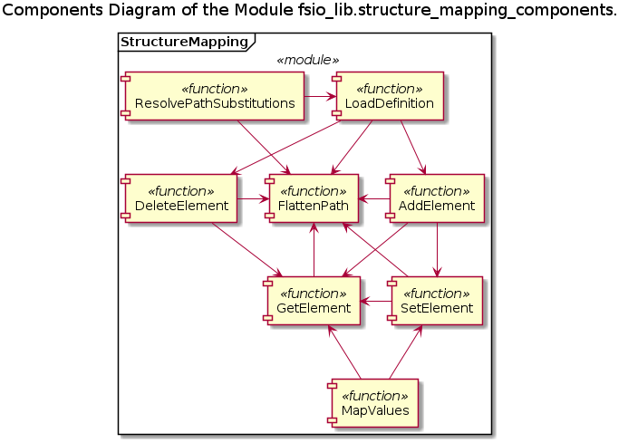

The helper function **FlattenPath**(), see [Illustration 3](#ill3), performs two tasks:

* It checks that the provided path to an element is constructed according to the DSL specifications in [DE001 document](./DE001_Mapping_DSL_Specification.md), i.e. it consists of non-negative integers, strings, dictionaries with string keys and numeric / boolean / string values, (nested) sequences of such elements
  - not allowed: empty strings, '$' or '#' single element strings, strings not starting with '$' or '#' and containing dots ('.') with empty substrings between (e.g. '.', '.a', 'a.' or 'a..b')
  - A **ValueError** or **TypeError** exception is raised if the path is not proper
* It converts the proper paths into the flat lists of elements, where each element defines precisely one level of nesting:
  - dot notation argument resolution strings are converted into a sequence of strings, e.g. 'a.b.c' -> ['a', 'b', 'c'], unless they start with '$' or '#'
  - nested sequences (lists, tuples, etc.) are flattened, e.g. ['a', ['b', 'c']] -> ['a', 'b', 'c'] - this process is recursive

<a id="ill3">Illustration 3</a>

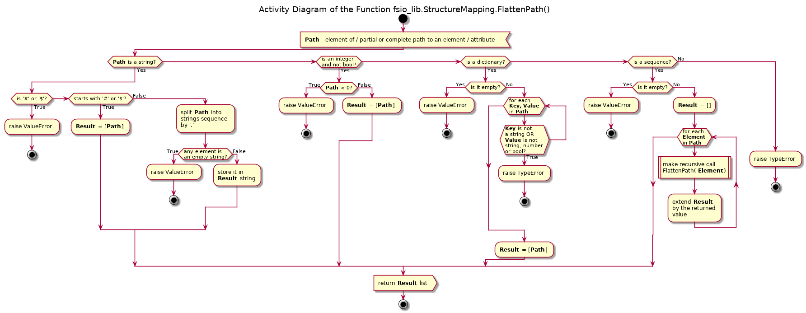

The helper function **ReslovePathSubstitutions**(), see [Illustration 4](#ill4), is responsible for the resolution of the, possibly nested, definitions of the *path substutions* into a flat dictionary with the string keys (starting with '$') paired to the proper and flattened paths as their values (see **FlattenPath**() function). The principal work flow is based on repetitive iteration through the dictionary of the definitions:

* if a definition (value) does not contain any '$' strings (references to other definitions), this key : value pair is moved into another dictionary of the already resolved definitions
* if a definition contains the '$' strings, which are the already resolved, they are replaced by the corresponing definitions (paths)
* if a definition contains an unkown '$' string (not a key in either resolved or unresolved definitions), the **ValueError** exception is raised
* this process repeats until all definitions are resolved (success) or not a single definition amongst the remaining is resolved during the last iteration (failure, circular dependece -> **ValueError**).

The function itself raises **TypeError** if the received argument is not a dictionary object or it contains not string keys. The substitution definitions (paths to an argument) are always flattened (see **FlattenPath**() function), thus the improper path definitions are caught, and they result in **ValueError** or **TypeError** being raised.

<a id="ill4">Illustration 4</a>

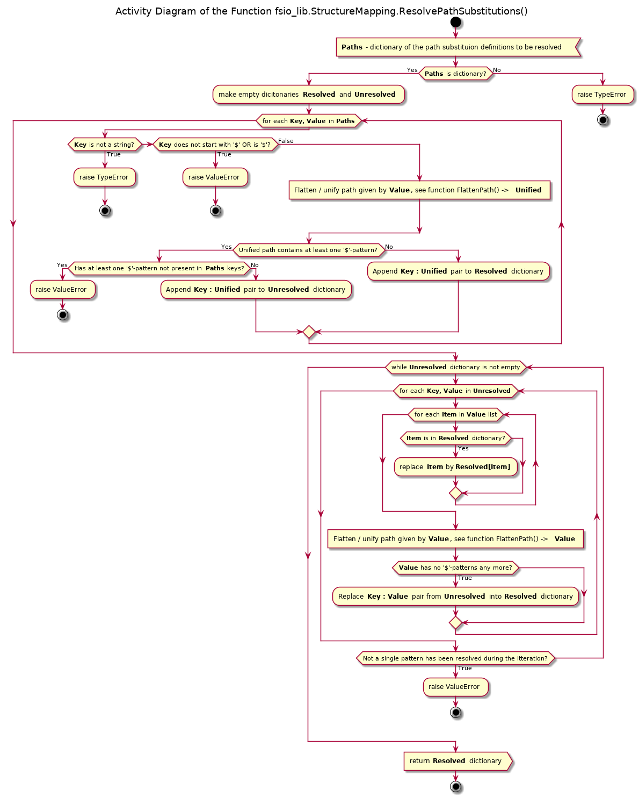

The helper function **GetElement**(), [Illustration 5](#ill5), serves as a 'universal' interface for retrieval of a nested element of a container object using a proper path to it. The received path is flattened / unified using the function **FlattenPath**() first, there the improper paths are rejected resulting in a **ValueError** or **TypeError** exception being raised.

If the path is defined properly (according to the specification), the function attempts to travers the target object descending one nesting level deeper for each consecutive element of the path. If the corresponding element cannot be found at the current level of nesting, an **AttributeError**. Such situation occurs if the structure of the target object is different than expected, for instance:

* a dictionary does not have an entry with such key name, or an 'struct' object does not have an attribute with such name
* a numeric index is outside the range of a sequence type object
* a sequence does not contain an element, which has all required attributes / keys with the required values
* the current level is a sequence, whereas the next level element is referenced by a name in the path
* the current level is not a sequence or compatible types, whereas the next level element is referenced by an index or 'choice' dictionary

As soon as the end of the path is reached without exceptions being raised, the function stops descending along the target object structure. If the last (deepest) obtained element is an 'end-node' / 'leaf' its value might as well be of a scalar type, e.g. a string. If the type of that element is string, and its value can be converted into an integer or floating point number, such conversion is performed before the exctracted value is returned. This 'trick' takes care of the limitations of the XML format, that the attributes of a node may hold only string values.

<a id="ill5">Illustration 5</a>

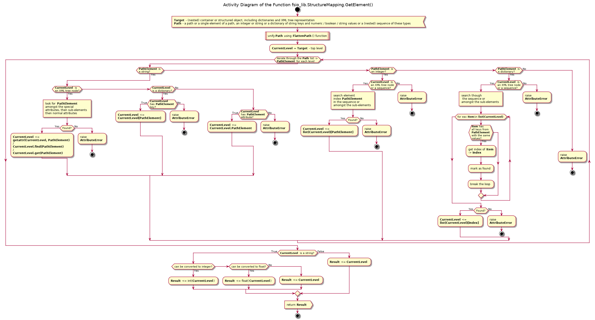

The helper function **SetElement**() - as the 'universal' interface for changing the value of an *existing* element of a container object, see [Illustration 6](#ill6) - relies upon the function **FlattenPath**() to unify the path and to perform the check if the path is properly defined, and then on the **GetElement**() function in order to check if the destination element is indeed present in the target object.

If there were no exceptions, meaning not only proper definition of a path but also that the structure of the target object matches it, the function attempts to change the value of that element using different strategies based on the type of the new value and the type and 'function' of the element referenced by the path. Basically, the rules are:

* An XML node element can be replaced only by another XML element, and its position within the sub-elements list should not be changed
* The value of an attribute of an XML node can be replaced by any value (with the forced conversion into a string), except for an XML node
* An element in a basic sequence (not XML sub-elements list within a node) can be replaced by any type value, but at the same position (index)

The function raised **TypeError** exception, if the type of the new value (to be assigned) is not appropriate for the destination element within the target object (based on its current type and 'function').

<a id="ill6">Illustration 6</a>

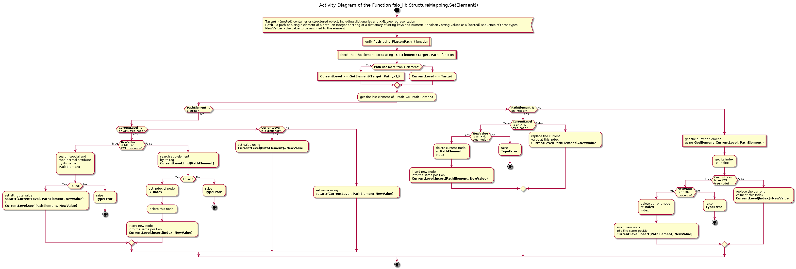

The function **DeleteElement**(), [Illustration 7](#ill7), is responsible for removal of an *existing* nested element within the target object. Note, that it simply removes the 'node' defined by the path, whereas any 'branches' attached to it may still exist as objects in the memory, but they become inaccessible within the target object. There are also no checks on if the 'branch' to which the deleted element belonged becomes 'dead' (no 'leaves' remaining at any 'node' up to a certain one).

It relies upon the function **FlattenPath**() to unify the path and to perform the check if the path is properly defined, and then on the **GetElement**() function in order to check if the destination element is indeed present in the target object. If there were no exceptions raised, the destination element is present in the target object. Based on the type and 'function' of the destination element: is it an XML node`s attribute, an attribute of an 'struct' like object, a key of a dictionary, or an element of a sequence - the appropriate method is used for its removal from the target object structure.

<a id="ill7">Illustration 7</a>

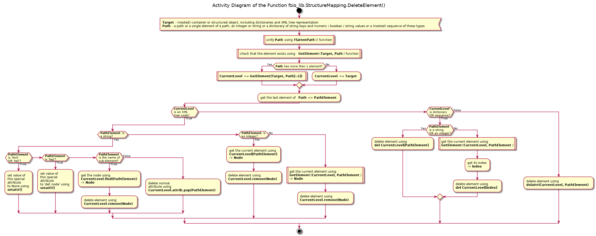

The last helper function **AddElement**(), [Illustration 8](#ill8), extends the functionality of the function **SetElement**(). If the destination element in the target object already exists, it simply calls the function **SetElement**() to change it value. Otherwise, the function searches the last (deepest) element in the target along the path, which still exists. This is the 'branching' point. A new branch is constructed from the remaining ('missing') part of the path from the top to the bottom, which branch is attached to the last found element (the 'branching' pooint). The base rules are:

* For the target object being an XML node all intermediate elements in the branch to be attached are XML nodes, whereas the 'functional type' of 'end' element is defined by the actual data type of the new value:
  - if the new value (to be assigned) is an XML node itself the created branch of the nested sub-elements is constructed from all names in the 'missing' part of the path, and the new value is attached as an extra (the deepest) sub-element
  - Otherwise the new branch is constructed from all but the last names in the 'missing' part of the path, whereas the last name in the path is used as the name of an attribute, which is added to the deepest sub-element, and the passed new value is converted into a string and assigned to this attribute
  - the 'branching' point (the last found element along the path) must be an XML node, otherwise an **AttributeError** is raised
* For the other types of the target object, the branch is constructed as nested dictionaries, and the last name in the path is used as the key in the deepest dictionary, to which the new value is paired (assigned)
  - If the 'branching' point is a sequence, the new branch is constructed directly from the first element in the 'missing' path, and the entire branch (as a dictinary) is appended to that sequence as its last element\
  - Otherwise, the new branch is constructed starting from the second element in the 'missing' path, whereas the first element of the 'missing' path is used as the key / attribute name to be added to the 'branching' point object, and the created branch is assigned to this key / attribute
  - the 'branching' point (the last found element along the path) must be a mutable object, otherwise an **AttributeError** is raised

There are two additional rules concerning the path to the destination element in the target object:

* The numeric indexes and 'choice' dictionaries are allowed in the path only up to the 'branching' point; they are not allowed in the 'missing' path part, where only the sting elements (names) are allowed
* The provided path may be empty: as None value, an empty string or an empty sequence - but only in the case of the target object and the new value to assign both being XML nodes; this is an exception from the specifications on a proper path to an element, and it is applicable only if a new sub-element is to be attached to the 'root' element of an XML tree representation

<a id="ill8">Illustration 8</a>

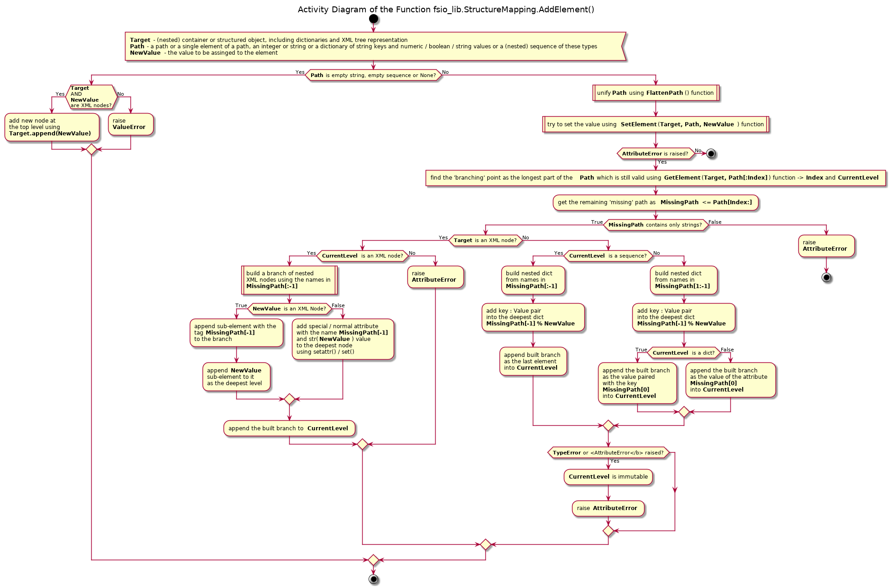

The 'main' function **LoadDefinition**() is responsible for loading a JSON file and parsing it into a mapping definitions dictionary stored as Python **dict** object. Naturally, it performs all required checks on the input data being in accordance with the DE001 DSL specifications. It is also responsible for logging of the exceptions, if such are raised in the process and the logger object is provided (as the optional argument -> default parameter).

In short, its work flow is:

* Load and parse all required *include* files into proper mapping definitions, which is (under the hood) the recursive calls to itself, and form the *value substitutions* dictionary
* Remove the processed *includes* entry from the *Buffer* (which stores the loaded JSON data)
* Form the *path substitution* dictionary by resolving the possible mutual dependencies amongst the corresponding definitions
* Remove the processed *paths* entry from the *Buffer*
* Find all *extra* entries, which are not nested dictionaries and do not include any substitution patterns, copy them into the *Result* dictionary and remove from the *Buffer*
* Find all *direct* mapping rules definition sub-dictionaries, walk them recursively and apply the *path and value substitutions*
* Find all *incremental additions* sub-dictionaries, walk them recursively and apply the *path and value substitutions*
* Add new rules defined by the *incremental additions* into the corresponding *direct* mapping rules definition sub-dictionaries
* Find all *incremental removals* definitions and remove the corresponding rules from the respective *direct* mapping rules definition sub-dictionaries
  - Delete all resulting 'dead branches', up to the *direct* mapping rules definition sub-dictionary itself
* Copy the fully resolved and updated *direct* mapping rules definition sub-dictionaries into the *Result* dictionary
* Remove the *direct* mapping rules definition sub-dictionaries, *incremental additions* sub-dictionaries and *incremental removals* definitions from the *Buffer*
* Analyze the remaining content of the *Buffer*
  - Raise corresponing errors based on the remaining content (if any)
* Return the *Result* dictionary if no errors occurred

This work flow is complex, therefore it is split down into a series of (nested) calls to 'private' helper functions. They are not supposed to be called outside the module, so their API is not provided in this document, but their work flow is given. In addition, the entire work flow (see [Illustration 9](#ill9)) such that the exceptions raised by the helper functions are caught, logged (if a logger object is provided as the optional (keyword) argument, see [Illustration 10](#ill10)) and re-raised as **ValueError**, except for **IOError** / **OSError** raised during the JSON file reading / parsing, which are re-raised with the original type.

<a id="ill9">Illustration 9</a>

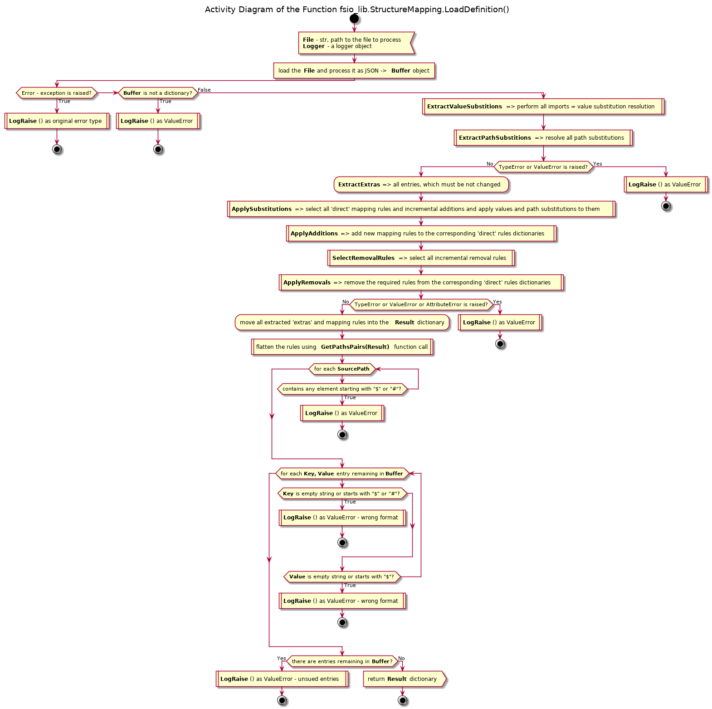

<a id="ill10">Illustration 10</a>

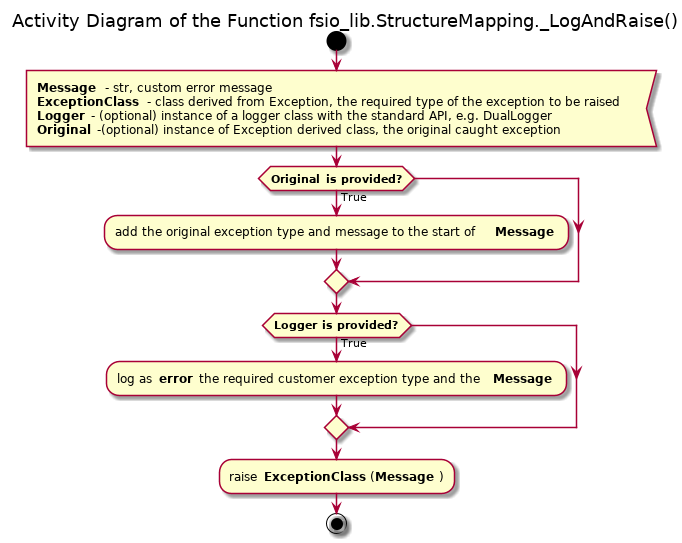

Each file referenced in the special entry "INCLUDES" is loaded and parsed into a proper mapping definitions dictionary by recursive call (back to) the **LoadDefinition**() function (see [Illustration 11](#ill11)). If not the entire content of the imported file but only its (sub-) element is required - that element is extracted with help of **GetElement**() function by its path, otherwise the entire imported content is treated as the *value substitution*. Before assigment of that value to the corresponding patten ("#..." string) the sanity checks are performed on it using either **FlattenPath**() function or **WalkDict**() function (if it is a dictionary, see [Illustration 12](#ill12)) with an empty *substitutions* dictionary passed as an argument.

<a id="ill11">Illustration 11</a>

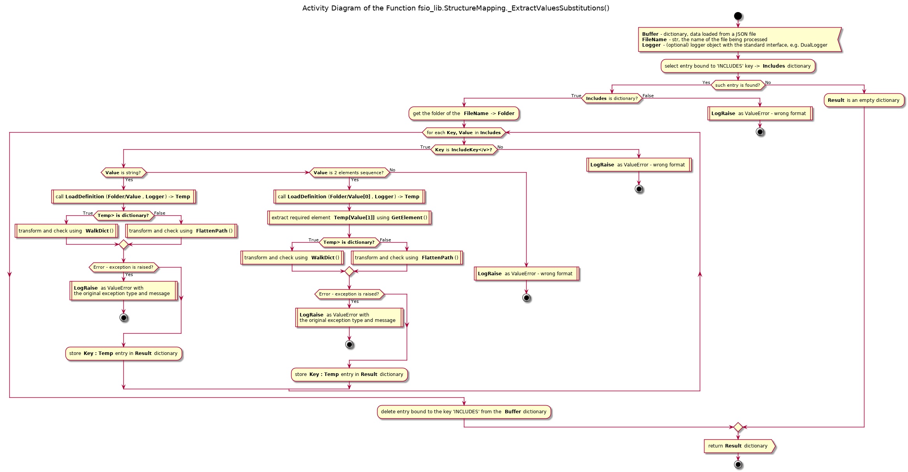

<a id="ill12">Illustration 12</a>

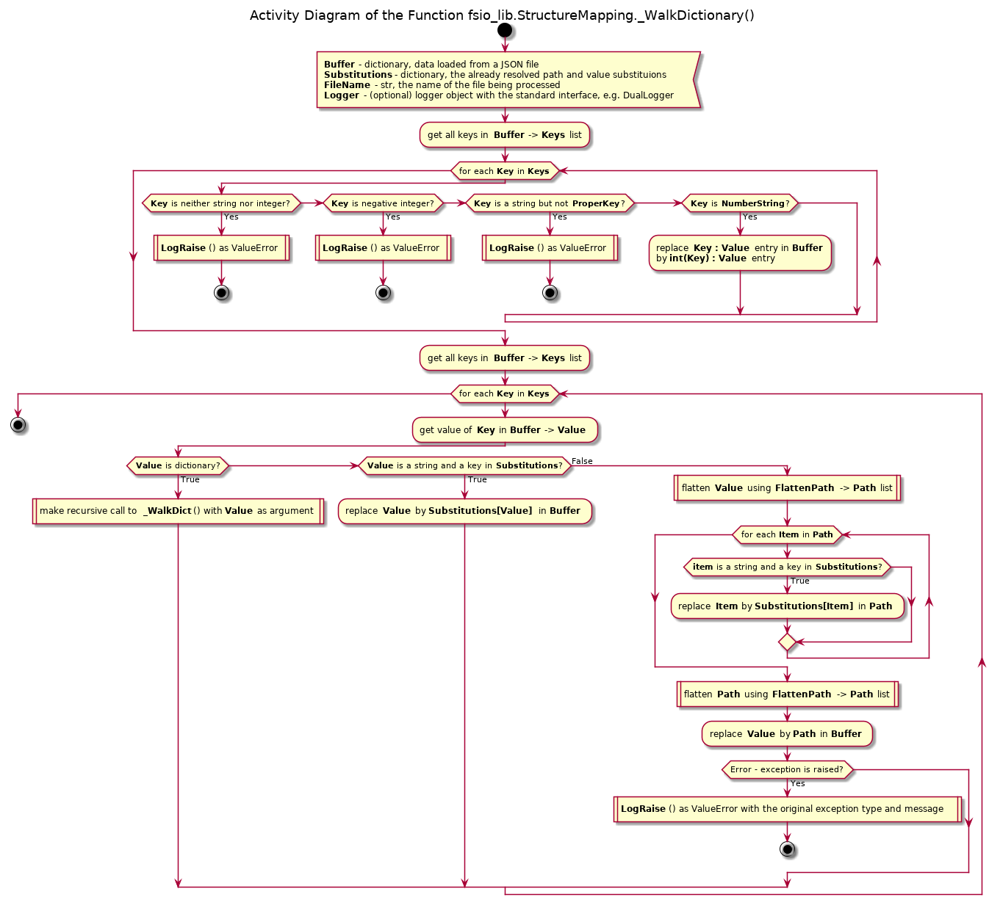

The **WalkDict**() function iterates through all elements of the passed dictionary in the 'depth-first' order recursively calling itself for each found nested dictionary element. It replaces all quoted non-negative numbers (in a string) keys by the corresponding integer numbers preserving the bound values at each nesting level, and replaces the end elements values with the unified (flat list) paths using the **FlattenPath**() function. Finally, it also applies the *path and value substitutions* to the unified end elements values, if the corresponding *substitutions* dictionary is passed as an argument.

The *path substitution* in [Illustration 13](#ill13) is based on extraction of the value of the special entry 'PATHS' and processing it with the help of the function **ResolvePathSubstitutions**().

<a id="ill13">Illustration 13</a>

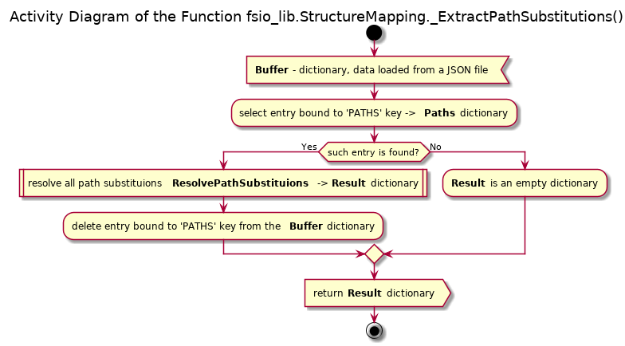

The *extras* extraction from the *Buffer* dictionary is based on the values of the top-level keys and their bound values. The key must be a string, but not a special entry "PATHS" or "INCLUDES", and not starting with "#", "$", "+" or "-". The bound value can be either boolean or numeric (integer or floating point) or a string, but not starting with "#" or "$". The extracted entries are removed from the *Buffer*.

<a id="ill14">Illustration 14</a>

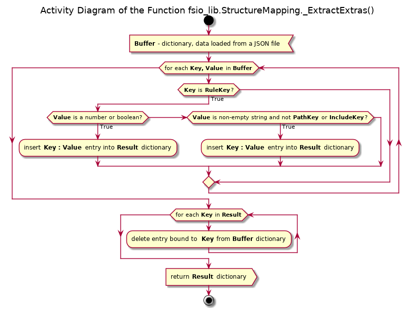

The *direct* mapping rules (first) and *incremental addition* rules (after that) are extracted (see [Illustration 15](#ill15), [Illustration 16](#ill16) and [Illustration 17](#ill17)) based on the following rules:

* For *direct* mapping rules
  - The entry name (key) is a string, but not starting with "#", "$", "+" or "-"
  - The bound value is either a dictionary or a string starting with "#" (*value substitution*)
* For the *incremental addition* rules
  - The entry name (key) is a string starting with the "+" and the corresponding *direct* mapping set of rules is found (same name but without "+")
  - The bound value is a dictionary with all keys at the top level being strings as quoted proper Python identifiers (excluding "_" - single underscore) or quoted non-negative integers

The extracted entries are removed from the *Buffer* and are stored in the *rules* dictionary. Before this dictionary is returned as the result of the call, all entires in it are 'unified' by flattening the actual *source* object elements paths stored as the end values (leaves of the nested dictionary structure) and application of the substitutions using **WalkDict**() and **FlattenPath**() functions.

<a id="ill15">Illustration 15</a>

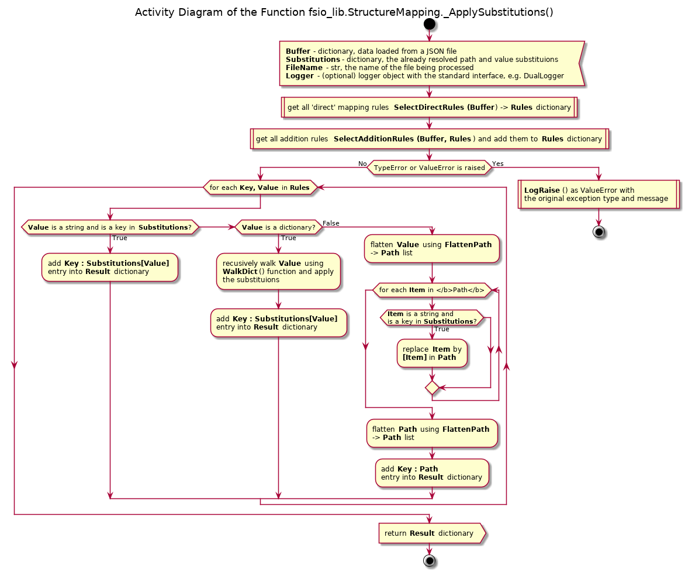

<a id="ill16">Illustration 16</a>

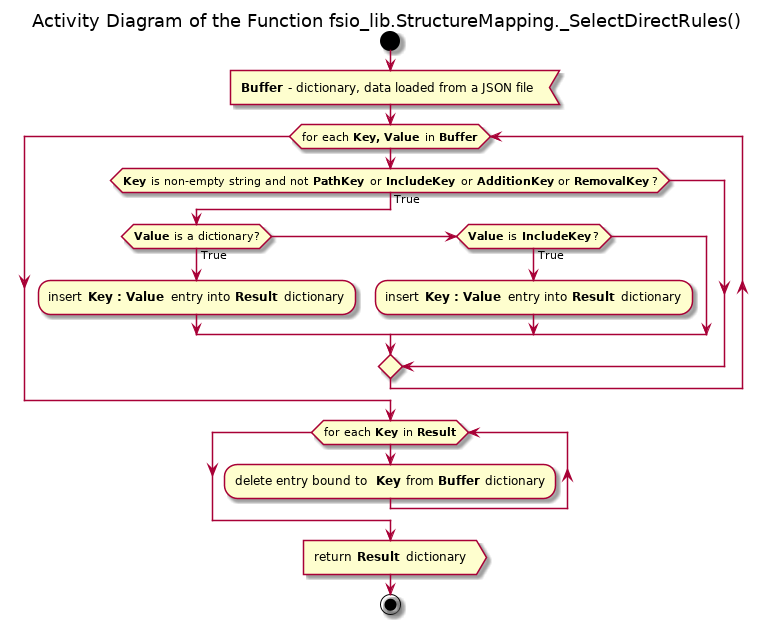

<a id="ill17">Illustration 17</a>

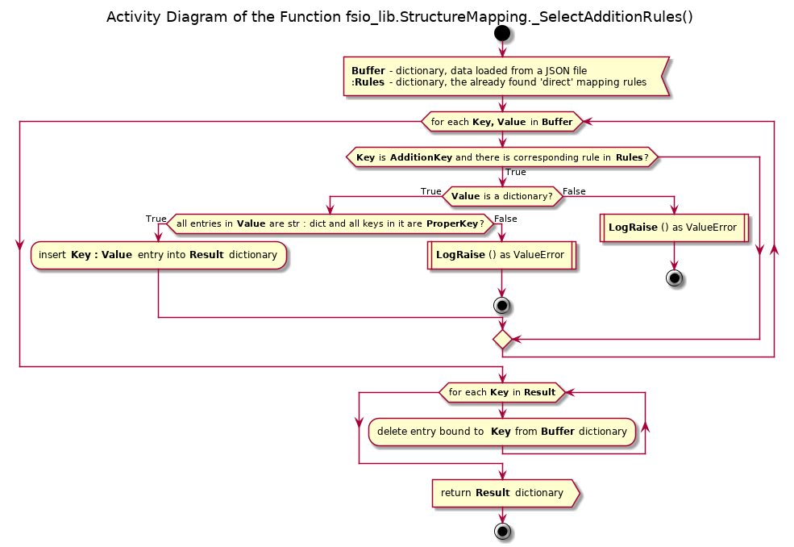

After that the *incremental additions* are applied, see [Illustration 18](#ill18). For each addition rule the corresponding *direct* mapping rule sub-dictionary is chosen as *target* object. The addition rule is walked top to bottom along the *target path* (except the last element) and the *target* object is checked, if it contains the corresponding (nested dictionary) element. If such element is not present, it is created as an empty dictionary bound to the key with the name corresponding the current element down the *target path*. The pointer is moved down the *target path*. Finally, the *source path* is stored as the value bound to the key with the name equal to the last element in the *target path* in the current (nested) dictionary. Note that if all elements along the *target path* were present, a new entry is not created, but its value (*source path*) is simply changed.

<a id="ill18">Illustration 18</a>

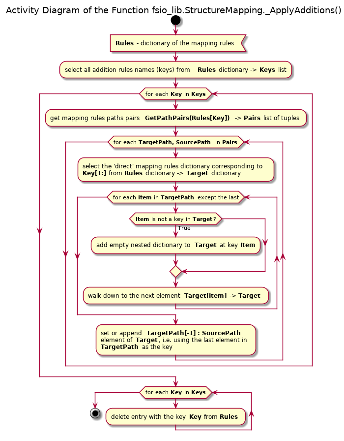

In order to simplify the navigation each mapping rule stored as a dictionary (with each level corresponding to a single element in the *source path*) is flattened into a tuple of lists using work flow shown in [Illustration 19](#ill19). All rules corresponding to a single set (*direct* or *incremental addition*) are returned as a list of tuple. Basically, the passed dictionary is walked top-down (depth-first) until the end value is found, which is the *source path* stored as not a dictionary value; otherwise (for a dictionary value bound to the current key) - the recursive call to the same function is made, whilst the already walked down *target path* is stored in the *accumulator*.

<a id="ill19">Illustration 19</a>

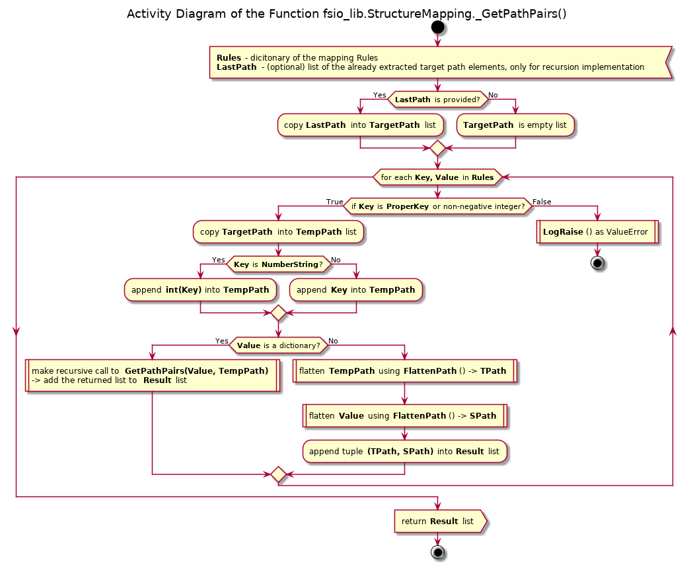

After that the *incremental removals* definitions are extracted (and deleted) from the *Buffer* dictionary, see [Illustration 20](#ill20). The selection process is based on the following rules:

* The entry name (key) is a string starting with the "-" and the corresponding *direct* mapping set of rules is found (same name but without "-")
* The bound value is a sequence (but not a string) with all elements being proper path definitions

<a id="ill20">Illustration 20</a>

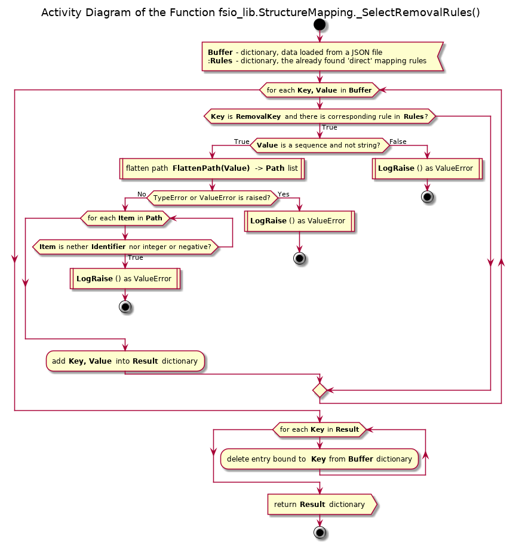

Finally, these *incremental removals* definitions are applied: the corresponding entries for the *target paths* are removed from the respective *direct* rules dictionaries, see [Illustration 21](#ill21). The *target path* to be removed is unified using **FlattenPath*() function and walked top - down. If any element along it is not present in the respective *direct* mapping rules dictionary, the ValueError exception is raised. If the last element in the path is reached, the corresponding entry (key : value pair) is removed. After that the walked path re-traced bottom-up. Any empty dictionary encountered is removed. Note that that this situation ('dead branch') can occur only if there is the deleted entry was the only end value along the path starting with specific point. Finally, if after the removal of the 'dead branch' the corresponding set of the rules does not contain any other rule definition, the rules set itself is deleted.

<a id="ill21">Illustration 21</a>

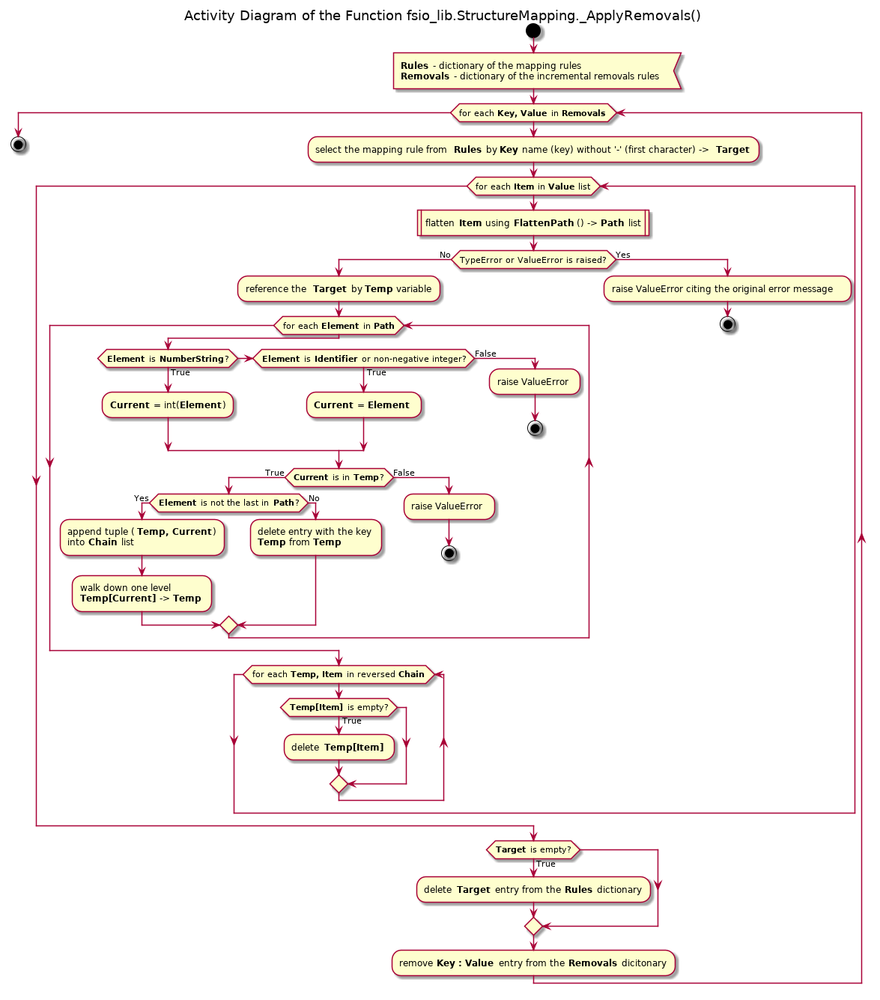

The sanity checks performed by these helper functions on the keys / values of the dictionaries are based on the mapping DSL specifications. The most commonly used are implemented as helper functions themselves returning boolean values:

* **IsIdentifier**(): True if the passed argument is not an empty string with the first character being an underscore ("_") or lower / upper case letter, followed by any number of underscores, letter or digits - excluding the single underscore case
* **IsNumberString**(): True if the argument is not an empty string and consists of only digit characters - i.e. quoted non-negative integer
* **IsProperKey**(): **IsIdentifier**() OR **IsNumberString**() - the allowed format for the mapping rules set keys - single elements along the *target path*
* **IsPathKey**(): True if the passed argument is a string of length > 1 and starting with "$" character
* **IsIncludeKey**(): True if the passed argument is a string of length > 1 and starting with "#" character
* **IsAdditionKey**(): True if the passed argument is a string of length > 1 and starting with "+" character
* **IsRemovalKey**(): True if the passed argument is a string of length > 1 and starting with "-" character
* **IsRuleName**(): True if the passed argument is a valid rules set name, i.e.:
  - is not an empty string, excluding single underscore case
  - AND NOT **IsPathKey**()
  - AND NOT **IsIncludeKey**()
  - AND NOT **IsAdditionKey**()
  - AND NOT **IsRemovalKey**()
  - AND not a special entry "PATHS" or "INCLUDES"

The second 'main' function **MapValues**() copies the values of the specified elements of the *source* object into the specified elements of the *target* object following the provided mapping rules. Normally, it is assumed that all *source elements* as well as the *target elements* are accessible, i.e. all mapping rules in the provided set fit the actual structure of the *source* and *target* objects. If the mapping rules do not fit the *source* or the *target* object, in the default *strict* mode an **AttributeError** exception is raised. The default behaviour can be explicitely overridden with help of the boolean flags (default parameters) passed as optional positional or keyword arguments.

Reagrdless of the optional settings and types of the *target* and *source* objects the *mapping rules* object is checked to be a dictionary and that its structure conforms the DE001 mapping DSL specifications (see [Illustration 22](#ill22)). **TypeError** / **ValueError** is raised unconditionally if this check has failed. The mapping dictionary structure check is delegated to the helper function, which also flattens the dictionary into a list of tuples of 2 list elements: as pairs of the *unified* paths to the elements within the target and source objects.

For each pair (single mapping rule) the value of the respected element in the source object is retrived first. If such element is not found, the flag *bStrictSource* defines the process flow:

* In the *strict* mode (**True**) and AttributeError exception is raised
* In the *soft* mode (**False**) the current rule is simply ignored, but a warning is issued (if a logger object is passed as an argument) and the function proceeds with the next iteration

If the source element is found, the function attemps to copy its value into the corresponding element of the target object. If such element is not found, the combination of the flags *bStrictTarget* and *bForceTarget* defines the process flow:

* In the *strict* mode (*bStrictTarget* is **True**) and AttributeError exception is raised
* In the *soft* mode (*bStrictTarget* is **False**):
  - if *bForceTarget* is **False** (default) - the current rule is simply ignored, but a warning is issued (if a logger object is passed as an argument) and the function proceeds with the next iteration
  - if *bForceTarget* is **True** - a warning is issued (if a logger object is passed as an argument) on the failed assignment, and then the function attempts to insert a new element (and, all missing intermediate elements along the path) and assign the extract *source* value to it; note that **TypeError** or **ValueError** can still be raised, if this operation is not possible, e.g. because of immutable objects along the path

The function also logs all exceptions if a logger object is provided to it.

<a id="ill22">Illustration 22</a>

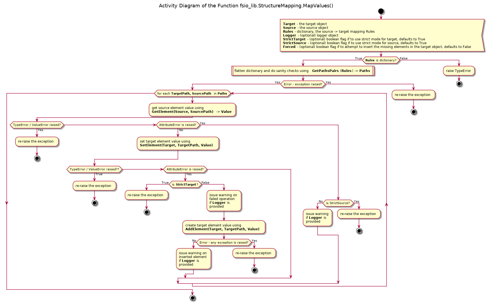

## Usage

### Illustration of the Rules: Path and Value Substitutions, Incremental Changes

Consider a chain of definitions:

**file_1.json**

```json
{
    "a" : 1,
    "b" : {"path" : ["a", 1, {"b" : true}, "c"]},
    "c" : 3,
    "1" : "something"
}
```

**file_2.json**

```json
{
    "INCLUDES" : {"#1" : "file_1.json"},
    "d" : "#1"
}
```

**file_3.json**

```json
{
    "INCLUDES" : {"#1" : "file_1.json",
                    "#2" : ["file_2.json", "d"]},
    "PATHS" : {"$1" : "c.d"},
    "rule_1" : {"a" : "#1",
                "b" : "#2",
                "c" : "a.b",
                "d" : ["$1", 1],
                "e" : "$1"
    }
}
```

**file_4.json**

```json
{
    "INCLUDES" : {"#1" : ["file_3.json", "rule_1"]},
    "PATHS" : {"$1" : "c.d"},
    "rule_1" : "#1",
    "rule_2" : {
        "a" : {
            "b" : {
                "c" : "$1"
            }
        }
    },
    "rule_3" : {
        "a" : {
            "b" : {
                "c" : 1
            },
            "0" : {
                "e" : "$1",
                "d" : 2
            }
        }
    },
    "-rule_2" : ["a.b.c"],
    "-rule_3" : ["a.b.c", ["a", 0, "d"]],
    "+rule_3" : {
        "a" : {
            "0" : {
                "f" : 2
            },
            "1" : {
                "d" : {
                    "f" : "$1"
                }
            }
        }
    }
}
```

The results of the **LoadDefinition**() function are:

**file_1.json** -> Python dictionary

```python
{
    "a" : 1,
    "b" : {"path" : ["a", 1, {"b" : true}, "c"]},
    "c" : 3,
    "1" : "something"
}
```

All entries but "*b*" are interpreted as *extras*, therefore, neither keys nor values are changed.

**file_2.json** -> Python dictionary

```python
{
    "d" : {
        "a" : [1],
        "b" : {"path" : ["a", 1, {"b" : true}, "c"]},
        "c" : [3],
        1 : ["something"]
    }
}
```

The entire content of the **file_1.json** is interpreted as a mapping definition, which is assigned to the rule "*d*".

**file_3.json** -> Python dictionary

```python
{
    "rule_1" : {
        "a" :{
            "a" : [1],
            "b" : {"path" : ["a", 1, {"b" : true}, "c"]},
            "c" : [3],
            1 : ["something"]
        },
        "b" : {
            "a" : [1],
            "b" : {"path" : ["a", 1, {"b" : true}, "c"]},
            "c" : [3],
            1 : ["something"]
        },
        "c" : ["a", "b"],
        "d" : ["c", "d", 1],
        "e" : ["c", "d"]
    }
}
```

The entire content of the **file_1.json** is interpreted as a mapping definition, which is assigned to the entry "*a*" of the rule "*rule_1*", and the rule "*d*" from the file **file_2.json** is assigned to the entry "*b*" of the rule "*rule_1*". Note, that the path substitution pattern "$1" is resolved into sub-path \["c", "d"\] and is used in the definition of the entries "*d*" and "*e*".

**file_4.json** -> Python dictionary

```python
{
    "rule_1" : {
        "a" :{
            "a" : [1],
            "b" : {"path" : ["a", 1, {"b" : true}, "c"]},
            "c" : [3],
            1 : ["something"]
        },
        "b" : {
            "a" : [1],
            "b" : {"path" : ["a", 1, {"b" : true}, "c"]},
            "c" : [3],
            1 : ["something"]
        },
        "c" : ["a", "b"],
        "d" : ["c", "d", 1],
        "e" : ["c", "d"]
    },
    "rule_3" : {
        "a" : {
            0 : {
                "e" : ["c", "d"],
                "f" : [2]
            },
            1 : {
                "d" : {
                    "f" : ["c", "d"]
                }
            }
        }
    }
}
```

Note that incremental removal rule *"-rule_2" :: "a.b.c"* removed the element *rule_2.a.b.c*, which resulted in the dead branch *a.b*, which has been also removed, resulting in an empty rule (dictionary) *rule_2*. Therefore, the entire rule has been removed.

The incremental removal rule *"-rule_3" :: "a.b.c"* similarly removed the entire branch *a.b.c*, whereas the rule *"-rule_3" :: ["a", 0, "d"]* - only the end element. The first incremental addition rule added the end element *rule_3\[a\]\[0\]\[f\]*, and the second rule - the entire brach (all intermediate nodes) *rule_3\[a\]\[1\]\[d\]\[f\]*.

**Reminder**: the incremental additions are applied to the **existing rules** *before* the incremental removals.

### Use of Choice Dictionaries

Consider a situation, when a software performs some measurements repeatively until a proper value is received, i.e. in the case of failures the measurement is repeated, and it logs all attempts in an XML file of the following structure:

```xml
<root operator="me" software="tester" version="0.1.0">
    <reports>
        <trial id="0" result="FAIL" time="12:05" value="-1"/>
        <trial id="1" result="FAIL" time="12:07" value="-2"/>
        ...
        <trial id="9" result="FAIL" time="13:27" value="0"/>
        <trial id="10" result="PASS" time="13:30" value="170"/>
    </reports>
```

And one wants to extract the data of the PASS measurement and store it in a nested dictionary of the following structure:

```python
{
    "settings" : {
        "operator" : "?",
        "software" : "?",
        "version" : "?"
    },
    "result" : {
        "time" : "?",
        "value" : "?"
    }
}
```

All attempted measurements (nodes *trial*) can be accessed by their index from the node *reports*, but the number of the performed measurements is not known *a priori* and the negative indexing (as "-1" - the last element) is not allowed by the mapping DSL specifications. So, the solution is to *choose* the specific node *trial*, which has attribute *result* and its value is "PASS". Therefore, the proper mapping rules set is:

```json
{
    "settings" : {
        "operator" : "operator",
        "software" : "software",
        "version" : "version"
    },
    "result" : {
        "time" : ["reports", {"result" : "PASS"}, "time"],
        "value" : ["reports", {"result" : "PASS"}, "value"]
    }
}
```

The same approach can be used when the *source* object contains a sequence (e.g. list) of dictionaries or struct-like objects, like **collections.namedtuple**.

### Selective Flattening of Structured Objects

Suppose that one wants to convert the content of a dictionary as in the previous example into a flat plain list of values in a specific order, say *software, version, operator, time, value*. The proper mapping rules set for such dictionary -> sequence conversion is:

```json
{
    "0" : "settings.software",
    "1" : "settings.version",
    "2" : "settings.operator",
    "3" : "result.time",
    "4" : "result.value"
}
```

**Note**: the target sequence object must be mutable, and it must contain at least 5 elements already!

The same mapping rules can be applied for flattening of an instance of **clsReport** class (see below), which has the same structure as the dictionary considered in this example.

```python
class clsSettings(object):
    def __init__(self):
        self.operator = ""
        self.software = ""
        self.version = ""

class clsResult(object):
    def __init__(self):
        self.time = ""
        self.value = ""

class clsReport(object):
    def __init__(self):
        self.settings = clsSettings()
        self.result = clsResult()
```

The advantage of this approach over any 'built-in' (into the objects themselves) serialization methods is that the amount of the data columns and their order can be easily changed via the mapping rules (template) instead of changes in the source code.

### Structuring of the Flat Data

Suppose that one needs to perform inverse operation, i.e. extract the specific elements from a flat sequence and store them in a structured object. For instance, the data from a sequence object created in the previous example is to be stored in an instance of the **clsReport** class (see above). The proper mapping rules considering the *software, version, operator, time, value* order in the source sequence is:

```json
{
    "settings" : {
        "operator" : 2,
        "software" : 0,
        "version" : 1
    },
    "result" : {
        "time" : 3,
        "value" : 4
    }
}
```

### Programming Interface

The simplest use case is loading a template (mapping rules) and application of them for the data extraction from a data source file into some object. The schematic (not complete) code is:

```python
import json

from fsio_lib.StructureMapping import LoadDefinition, MapValues

#load the data file, considering it being JSON
with open("SomeDataFile.json", "rt") as fFile:
    objSource = json.load(fFile)

#load the specific mapping rules
dictMapping = LoadDefinition("SomeRules.json")

#create target object, e.g. instance of some specific class
objTarget = SomeSpecificClass()

#perform mapping
MapValues(objTarget, objSource, dictMapping)
```

## API Reference

### Functions

**FlattenPath**(gPath)

Signature:

type A -> list(int OR str OR dict(str : int OR float OR str OR bool))

Args:

* *gPath*: type A, a path or a single element of a path to be flatten and unified, can be an integer or string or a dictionary of string keys and numeric / boolean / string values or a (nested) sequence of these types

Returns:

* list(int OR str OR dict(str : int OR float OR str OR bool)): a flat list (without nesting) with each element being either a number or a string or a dictionary of string keys and numeric / boolean / string values

Raises:

* **TypeError**: the input argument is not of the allowed type
* **ValueError**: negative index (integer path element) or an empty string, (nested) sequence or choice dictionary or part of the dot notation path reference is found

Description:

Flattens and unifies the path to an element / attribute of an object by converting it into a a flat list (without nesting) with each element being either a number or a string or a dictionary of string keys and numeric / boolean / string values. A string containg a dot notation path to an element / attribute is converted into a list of strings with each consecutive element referencing the corresponding level of the nesting.

**ResolvePathSubstitutions**(dictPaths)

Signature:

dict(str : type A) -> dict(str:list(int OR str OR dict(str:int OR float OR str OR bool)))

Args:

* *dictPaths*: dict(str : type A), dictionary of string keys (pattern names) and values being proper path to an element descriptions

Returns:

* dict(str : list(int OR str OR dict(str : int OR float OR str OR bool))) : dictionary of the same keys but values being fully resolved and flattened paths to elements / attributes

Raises:

* **TypeError**: either at least one key is not a string or at least one value of the input dictionary is not a proper path definition, or the received argument is not a dictionary
* **ValueError**: at least one element of at least one path definition is a negative index (integer path element) or an empty string, (nested) sequence or choice dictionary or part of the dot notation path reference is found to be empty; or there is a circular definition of patterns, or a missing pattern definition

Description:

Resolves and converts to the flat list format the path substitution definitions passed as a dictionary. Any path substitution definition may refer another substitution definition as long as the circular dependence is avoided.

Proper definition:

* {"$1" : "a", "$2" : "b", "$3" : ["$1", "$2"], "$4" : ["$3", "c"]}
* Is equivalent to {"$1": ["a"], "$2": ["b"], "$3": ["a", "b"], "$4": ["a", "b", "c"]}

Improper definitions:

* {"$1" : "a", "$3" : "$2"} - missing definition of "$2"
* {"$1" : "a", "$2" : "$3", "$3" : "$2"} - circular dependence of "$2" <-> "$3"

**GetElement**(objTarget, glstPath)

Signature:

type A, type B -> type C

Args:

* *objTarget*: type A, the target object, from which the value of an element is to be obtained, supposedly C-struct like object or a sequence (container), or a dictionary (mapping type), or an XML file content representation (**xml.etree.ElementTree.Element**)
* *glstPath*: type B, a path or a single element of a path to be flatten and unified, can be an integer or string or a dictionary of string keys and numeric / boolean / string values or a (nested) sequence of these types

Returns:

* type C: the value of the corresponding nested element, the numbers (floating point or integer) stored in a string are converted into float and int respectively.

Raises:

* **TypeError**: the second input argument is not of the allowed type
* **ValueError**: the second input argument is not of the allowed values
* **AttributeError**: any of the (nested) elements along the path is not found in the object

Description:

Extracts a value of an arbitrary level deep nested element of an object.

Flattens and unifies the path to an element / attribute of an object by converting it into a a flat list (without nesting) with each element being either a number or a string or a dictionary of string keys and numeric / boolean / string values. A string containg a dot notation path to an element / attribute is converted into a list of strings with each consecutive element referencing the corresponding level of the nesting.

After that attempts to find the corresponding element of the object by walking along the flattened / unified path. If the corresponding element is found it is converted into int or float if possible (only for string values) and returned. If any of the nested elements along the path does not exist, the **AttributeError** exception is raised.

Specifically for the **xml.etree.ElementTree.Element** instance objects:

* Resolution order by the name (string path element)
  - Special attributes: "tag", "text" and "tail"
  - Children sub-elements by their tags
  - Normal attributes of the node itself by their names
* When looking by an integer index or properties ("choice") dictionary only the direct children sub-elements are concerned

**SetElement**(objTarget, glstPath, gValue)

Signature:

type A, type B, type C -> None

Args:

* *objTarget*: type A, the target object, from which the value of an element is to be set, supposedly C-struct like object or a sequence (container), or a dictionary (mapping type), or an XML file content representation (**xml.etree.ElementTree.Element**)
* *glstPath*: type B, a path or a single element of a path to be flatten and unified, can be an integer or string or a dictionary of string keys and numeric / boolean / string values or a (nested) sequence of these types
* *gValue*: type C, the value to be assigned to the element (if found)

Raises:

* **TypeError**: the second input argument is not of the allowed type, or an XML node object is attempted to be assigned as an attribute of another XML node object (not as a sub-element), or a non XML node is attempted to be assigned to a sub-element of an XML node, or an immutable sequence as the last element is attempted to be modified
* **ValueError**: the second input argument is not of the allowed values
* **AttributeError**: any of the (nested) elements along the path is not found in the object

Description:

Assigns a value to an arbitrary level deep nested element of an object if such element is found within the object

Flattens and unifies the path to an element / attribute of an object by converting it into a a flat list (without nesting) with each element being either a number or a string or a dictionary of string keys and numeric / boolean / string values. A string containg a dot notation path to an element / attribute is converted into a list of strings with each consecutive element referencing the corresponding level of the nesting.

After that attempts to find the corresponding element of the object by walking along the flattened / unified path. If the corresponding element is found the new value is assigned to it. If any of the nested elements along the path does not exist, the AttributeError exception is raised.

Specifically for the **xml.etree.ElementTree.Element** instance objects:

* Resolution order by the name (string path element)
  - Special attributes: "tag", "text" and "tail"
  - Children sub-elements by their tags
  - Normal attributes of the node itself by their names
* When looking by an integer index or properties ("choice") dictionary only the direct children sub-elements are concerned
* An XML node object (as the new value) can only replace an existing sub-element of an XML node, but not the value of its attribute

**DeleteElement**(objTarget, glstPath)

Signature:

type A, type B -> None

Args:

* *objTarget*: type A, the target object, from which an element is to be deleted, supposedly C-struct like object or a sequence (container), or a dictionary (mapping type), or an XML file content representation (**xml.etree.ElementTree.Element**)
* *glstPath*: type B, a path or a single element of a path to be flatten and unified, can be an integer or string or a dictionary of string keys and numeric / boolean / string values or a (nested) sequence of these types

Raises:

* **TypeError**: the second input argument is not of the allowed type
* **ValueError**: the second input argument is not of the allowed values
* **AttributeError**: any of the (nested) elements along the path is not found in the object

Description:

Assigns a value to an arbitrary level deep nested element of an object if such element is found within the object

Flattens and unifies the path to an element / attribute of an object by converting it into a a flat list (without nesting) with each element being either a number or a string or a dictionary of string keys and numeric / boolean / string values. A string containg a dot notation path to an element / attribute is converted into a list of strings with each consecutive element referencing the corresponding level of the nesting.

After that attempts to find the corresponding element of the object by walking along the flattened / unified path. If the corresponding element is found the new value is assigned to it. If any of the nested elements along the path does not exist, the AttributeError exception is raised.

Specifically for the **xml.etree.ElementTree.Element** instance objects:

* Resolution order by the name (string path element)
  - Special attributes: "tag", "text" and "tail"
  - Children sub-elements by their tags
  - Normal attributes of the node itself by their names
* When looking by an integer index or properties ("choice") dictionary only the direct children sub-elements are concerned
* The 'text' and 'tail' attributes are not deleted, but set to None
* The 'tag' of the node is not deleted but set to 'def_node', i.e. the node is simply renamed to the 'def_node'; whereas the path ending in the name (tag) of a node but not in the string 'tag' results in the complete deletion of this node

**AddElement**(objTarget, glstPath, gValue)

Signature:

type A, type B, type C -> None

Args:

* *objTarget*: type A, the target object, supposedly C-struct like object or a sequence (container), or a dictionary (mapping type), or an XML file content representation (**xml.etree.ElementTree.Element**)
* *glstPath*: type B, a path or a single element of a path to be flatten and unified, can be an integer or string or a dictionary of string keys and numeric / boolean / string values or a (nested) sequence of these types
* *gValue*: type C, the value to be assigned to the end-path element

Raises:

* **TypeError**: the second input argument (path) is not of the allowed type, or an XML node object is attempted to be assigned as an attribute of another XML node object (not as a sub-element), or a non XML node is attempted to be assigned to a sub-element of an XML node, or an immutable object is attempted to be modified - in case of the existing end-element being overwritten
* **ValueError**: the second input argument (path) is not of the allowed values, or an 'empty' path is used not with the target object and new values both being XML nodes
* **AttributeError**: the 'missing' part of the path after the 'branching' point contains integer indexes or 'choice' dictionaries, or the 'branching' point is an immutable object / not XML node (attribute)

Description:

Assigns a value to an arbitrary level deep nested element of an object if such element is found within the object (overwrites) or attempts to create a new nested element with all missing 'parent' nodes along the path as well.

Flattens and unifies the path to an element / attribute of an object by converting it into a a flat list (without nesting) with each element being either a number or a string or a dictionary of string keys and numeric / boolean / string values. A string containg a dot notation path to an element / attribute is converted into a list of strings with each consecutive element referencing the corresponding level of the nesting.

An empty path ('', [], etc. OR None) is acceptable only for the XML node target object with the new value also being an XML node.

After that attempts to find the corresponding element of the object by walking along the flattened / unified path. If the corresponding element is found the new value is assigned to it. If any of the 'parent' node is missing along the path, the function attempts to create the missing nodes based on the type of the target object and the structure of the path.

The general rules applied are:

* The path may refer to an excisting element, in which case its value is overwritten using SetElement() function
* The path may refer to a not yet existing element, but at least part of it (the first one or several elements) may refer to an existing intermediate element, to which a new branch will be attached
* The existing elements / levels part of the path may include numeric indexes and 'choice' dictionaries up to the 'branching' point, but not after the 'branching' point -  only the string names; otherwise, the **AttributeError** exception is raised
* For non XML target objects: all but the last missing elements / levels are created as nested dictionaries paired to as values to the keys with the names taken from the 'missing' path elements (strings); whereas the last element in the 'missing' path is used as the key in the deepest nested dictionary and the passed value as its paired value
  - Inability to attach the created branch results in the **AttributeError**
* For the XML target objects: all but the last missing elements / levels are created as nested XML nodes using the names taken from the 'missing' path elements (strings) as their tags, and
  - if the passed value is an XML node itself, an extra nesting level node is added with the tag being the last element in the 'missing' path, and the passed value is attached as a node to this deepest nested created node
  - if the passed value is not an XML node, the value of the element in the 'missing' path is used as the attribute name, and the passed value converted to string as its value, and this attribute is attached to the deepest nested created node

Specifically for the **xml.etree.ElementTree.Element** instance objects:

* Resolution order by the name (string path element)
  - Special attributes: "tag", "text" and "tail"
  - Children sub-elements by their tags
  - Normal attributes of the node itself by their names
* When looking by an integer index or properties ("choice") dictionary only the direct children sub-elements are concerned
* An XML node object can be directly attached to another XML node (as root) using the 'empty' path (empty string, empty sequence or None) - this is the only exception of the general rule on the values of the path elements
* A special or normal attribute can be added only to a node
* If the 'branching' point (deepest exisiting element along the path) is not a node - the **AttributeError** exception is raised

**LoadDefinition**(strFile, objLogger = None)

Signature:

str/, logging.Logger OR 'LoggingFSIO.ConsoleLogger/ -> dict

Args:

* *strFile*: str, path to the definition file to load
* *objLogger*: (optional) **logging.Logger** or **'LoggingFSIO.ConsoleLogger**, instance of, a logger object compatible with the standard logger interface

Returns:

* dict: the mapping rules dictionary conforming the DE001 DSL specs

Raises:

* IOError: re-raised, some file I/O related problems
* OSError: re-raised, some file I/O related problems
* ValueError: the file is found, but it is not of a proper JSON format; OR the data read is not a dictionary; OR it does not comply with the mapping DSL specifications

Description:

'Main' function to load a JSON file and to parse the content into a mapping rules dictionary according to the DE001 DSL specifications.

**MapValues**(gTarget, gSource, dictMap, objLogger = None, bStrictTarget = True, bStrictSource = True, bForceTarget = False)

Signature:

type A, type B, dict/, logging.Logger OR 'fsio_lib.LoggingFSIO.ConsoleLogger, bool, bool, bool/ -> None

Args:

* *gTarget*: type A, the target object, into which the data is to be copied
* *gSource*: type B, the source object, from which the data is to be taken
* *dictMap*: the mapping rules dictionary, see DE001 DSL specifications
* *objLogger*: (optional) logging.Logger OR 'LoggingFSIO.ConsoleLogger, instance of, the logger object, by default is None (not provided)
* *bStrictTarget*: (optional) bool, flag if the target object MUST have all expected elements, default value is **True**
* *bStrictSource*: (optional) bool, flag if the source object MUST have all expected elements, default value is **True**
* *bForceTarget*: (optional) bool, flag is the missing elements / paths are to be created in the target object, has an effect only if the value of *bStrictTarget* is **False**, the default value for *bForceTarget* **False**

Raises:

* **TypeError**: wrong mapping dictionary format or missmatch between the structure of the target and source objects and the mapping rules
* **ValueError**: wrong mapping dictionary format or missmatch between the structure of the target and source objects and the mapping rules
* **AttributeError**: missing element of the target or source object if the corresponding flags are set to **True**, or an immutable element in the target object

Description:

A function to copy the values of some attributes or keys or sequence elements from a (nested) C struct (Pascal record), dictionary, sequence or *xml.etree.ElementTree.Element* object (source) into another object of one of these types.

The mapping rules should be a (nested) dictionary with keys at each level being strings (names) or non-negative integers (indexes) referring to an element of the target object at the same level. The values not being dictionaries themselves in the mapping rules dictionary are interpreted as paths to a certain element in the source object. Such paths can be an integer (index of a sequence), a string (name of an attribute or a key), a 'choice' dictionray (required sub-elements and their values for an unnamed elements in a sequence) or a (nested) sequence of there types.

The absence of the expected elements in the source or target elements is treated depending on the values of the default parameters (boolean flags), which values can be passed as the optional positional or keyword arguments.

* *bStrictTarget* is **True** (default) the absence of an expected element in the target object is an error, the **AttributeError** is raised, the value of the flag *bForceTarget* is ignored; it is **False** - the warning is issued (if a logger is provided) and the required element (with all missing intermediate element along the path) is created, if possible and the flag *bForceTarget* is **True** (default is **False**)
* *bStrictSource* is **True** (default) the absence of an expected element in the source object is an error, the **AttributeError** is raised; it is **False** - the warning is issued (if a logger is provided)

If an optional logger object with the standard API is provided, all raised exceptions and warnings are logged.