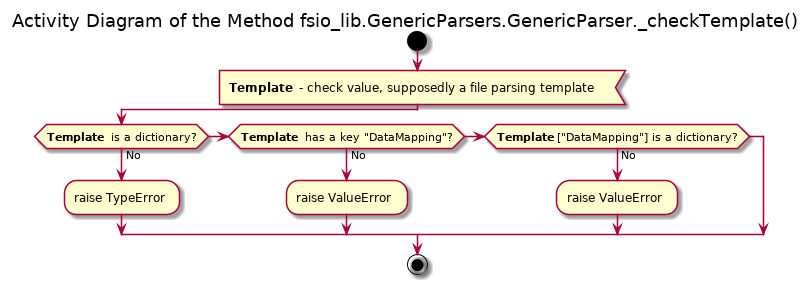

# UT005 Module GenericParsers Reference

## Table of Content

* [Scope](#Scope)
* [Intended Functionality and Use](#Intended-Functionality-and-Use)
* [Design and Implementation](#Design-and-Implementation)
* [Usage](#Usage)
* [API Reference](#API-Reference)

## Scope

This document describes the design, intended usage, implementation details and API of the module *GenericParser*, which implements singleton classes for parsing TSV, XML and JSON files with the data mapping onto specified class instances using the specified templates, and two functions wrapping these classes. The wrapping functions automatically select the required parser class based on the file extension and content.

Implemented 'public' objects:

* Prototype singleton class **GenericParser** with the public class methods
  - **parseSingleObject**()
  - **parseFile**()
  - **parseManyFiles**()
* Singleton class **TSV_Parser** derived from **GenericParser**
* Singleton class **JSON_Parser** derived from **GenericParser**
* Singleton class **XML_Parser** derived from **JSON_Parser**
* Function **parseFile**()
* Function **parseManyFiles**()

## Intended Functionality and Use

The purpose of this module is to facilitate the parsing of the TSV / JSON / XML files of *a priori* known and often used internal structure onto specific structure objects by means of the file parsing templates containing the mapping rules. In short, this is a front-end for the module *StructureMapping* with added functionality of the automatic source file structure recognition and selection of the proper parsing templates and the target object type / class. The module provides different levels of the process automatization / facilitation.

One can work directly with the module *fsio_lib.StructureMapping*: load the content of the source file using standard JSON (module *json* of the Standard Library) or XML (module xml.etree.ElementTree) or custom TSV parsers, manually define or load the mapping rules dictionary using the function *StructureMapping.LoadDefinition*(), create an instance of the target object and perform the mapping using the function *StructureMapping.MapValues*().

The lowest level of the functionality of this module is to wrap the source file loading, instantiation of the target object and mapping process. Thus, the user has to choose the appropriate parsing class and to provide only the path to the source file, dictionary of the mapping rules and the target type / class.

If the file parsing template containing the mapping rules also defines the intended target class / type, the user can still use any desired but compatible target class / type, or to omit the target class / type argument of the corresponding class methods call.

It is also possible to select the file parsing template based on the structure of the source file, but this functionality relies on the special search patterns (meta-templates), which are to be defined by the user, see [DE002 specifications](./DE002_Mapping_Template_Files_Specification.md). In such a case, the user does not have to specify the file processing template.

If the required file parsing template can be determined based on the source file content, and this template defines the intended target class / type, the user can only provide the path to a file without the target type and mapping rules.

Finally, the required parsing class can also be selected automatically based, at first, on the file extension and then on its content.

Additionally, a batch processing of the source files is supported. The user has to provide the path to the source data folder and the list of the base file names within this folder - all those files will be processed.

The Use Case Diagram in [Illustration 1](#ill1) provides an overview of the supported modes of operation.

<a id="ill1">Illustration 1</a>


## Design and Implementation

The functionality provided by the module is implemented as class methods of 3 singleton classes derived from the prototype singleton class (see [Illustration 2](#ill2)) and 2 functions wrapping the specific format parsing class methods.

<a id="ill2">Illustration 2</a>


All public class methods are implemented generically in the prototype class **GenericParser**, whereas the specialized sub-classes only re-implement / extend the functionality of the special 'private' helper class methods *_getHints*() and *_loadFile*().

The public class method *parseSingleObject*() in [Illustration 3](#ill3) is a wrapper for the function *StructureMapping.MapValues*() but it requires the target class / type instead of an instance of the target object as its argument. This method performs basic sanity data checks on the passed file parsing template ([Illustration 4](#ill4)) that:

* it is a dictionary
* it has the key "DataMapping"
* the value bound to this key is a dictionary

The passed target class / type is instantiated into the target object, and the dictionary bound to the key "DataMapping" of the passed file parsing template is used as the mapping rules dictionary. These objects are passed into the *MapValues*() function together with the source data object received as the first argument.

This method also accepts the optional (keyword) arguments: a logger object and boolean flags regulating the strictness of the mapping, which are passed into the *MapValues*() function as well.

<a id="ill3">Illustration 3</a>


<a id="ill4">Illustration 4</a>



The public class method *parseFile*() in [Illustration 5](#ill5) is the core functionality of the entire module. The user is supposed to provide the path to a file to be processed (mandatory), whereas the target type / class and file parsing template are optional. This method also accepts the optional (keyword) arguments: a logger object and boolean flags regulating the strictness of the mapping. Note that the default value for the flag for the Strict Target Mode is None, and in this case the method itself determines its True / False value based on the target type required by user and suggested by the template.

At first, the basic sanity data checks are performed on the received path to the source file, see [Illustration 6](#ill6):

* it a string
* it points to an existing file

After that the 'private' helper method *_getHints*() ([Illustration 7](#ill7)) is called with the None value as the first argument and the received template argument (or the default None value) as its arguments. This helper method returs a dictionary of parsing 'hints', which is passed together with the path to the source file into another helper method *_loadFile*().

The 'private' method *_loadFile*() is supposed to return a list of source data objects, e.g. in the case of a TSV file each line (row) is considered as a single source data object, or each dictionary element in the JSON file storing an array (list) of dictionaries. **Note**, that the method *_loadFile*() of the prototype class **GenericParser** simply returns an empty list.

If the returned by the *_loadFile*() method list is empty, it is simply returned as the result of the method *parseFile*(). Otherwise, the first element of it is passed together with the template again into the method *_getHints*(). The classes JSON_Parser and XML_Parser derived from this prototype extend the method *_getHints*() such that adiitional hints can be obtained based on the structure of the source data object, including the intended file parsing template as well as the suggested target class / type.

The following situations result in the **ValueError** exception being raised:

* the user did not specify the file parsing template and it cannot be determined on the basis of source data object
* the user did not specify the target class / type and it is not suggested by the template, or the template is also not provided and cannot be determined automatically

On the other hand, the following situations are legal:

* the user did not specify the file parsing template, but it is determined on the basis of the source data object - the automatically determined template is used for the further data processing
* the user did not specify the target class / type, but the template suggests one - the type / class suggested by the template is used for the further data processing

The "IS" / "IS NOT" relation between the target class / type specified by the user and suggested by the template defines the effective value for the Strict Targer Mode if the corresponding argument was not provided or the None value was passed:

* User did not specify the target class but the templates suggests one -> the flag is set to True
* User specified the target class:
  - the template has no suggestions for the target class / type -> the flag is set to True
  - the template suggests the same target class / type -> the flag is set to True
  - the template suggests different target class / type -> the flag is set to False

Note that the explicitly specified True / False values of the Strict Target Mode flag are not affected, neither are the other two flags.

After that each element in the list returned by the method *_loadFile*() is processed using the method *parseSingleObject*() and the obtained instances of the target class / type with the data from the corresponding source objects mapped onto them are packed into a list, which is returned.

<a id="ill5">Illustration 5</a>


<a id="ill6">Illustration 6</a>


<a id="ill7">Illustration 7</a>


The helper method *_getHints*() of the prototype class **GenericParser** requires two arguments: a source data object and the file parsing template dictionary. Both values cannot be None simultatneously - the **ValueError** exception is raised. The prototype implementation of this method does not do anything with the source data object, but it analizes the content of the file parsing template.

At first, it attempts to copy the "HeaderOffset" entry from the template into the 'hints' dictionary, which is later returned. If there is no such entry in the template - the "HeaderOffet" : None entry is added into the 'hints'. Then the presence of the entries "TargetClassModule" and "TargetClass" within the template is checked. If they exist they must properly reference an existing Python module and the name of a class defined in that module respectively. The method checks if the required class has been imported already into the namespace of the module. If such symbol is not found in the **globals**() dictionary, it is dynamically imported using the function *fsio_lib.dynamic_import.import_from_module*(). The reference to this class is added into the 'hints' as the value bound to the key "TargetClass".

The public class method **parseManyFiles**() in [Illustration 8](#ill8) is designed to parse several files within a single folder, which are specified by the path to the folder and the list of their base file names. Basically, it performs the data sanity checks on the paths and calls the method **parseFile**() for each file separately. The processed data is stored in and returned as an instance of the **collections.OrderedDict** with the base names as keys and the corresponding lists of the instances of the target class / type (mapped data) as their bound values.

The input data sanity checks performed by the method itself are:

* the path to the folder is a string
* the folder path indeed points to an existing folder
* base names argument is a sequence (not a string)
* each element in the list of the base names is a string

<a id="ill8">Illustration 8</a>


The specialized class **TSV_Parser** redefines only the helper method *_loadFile*(), but not the method *_getHints*(), therefore their public methods *parseFile*() and *parseManyFile*() require explicit passing of the file parsing template argument. The reason is that this parser needs to know the length of the header (how many first lines to skip) before it can load the file and the template cannot be reliably determined on the source file content in many practical cases.

The redefined method *_loadFile*() in [Illustration 9](#ill9) wraps the function *fsio_lib.locale_fsio.LoadTable*(), which can cope with CR / LF and CRLF line endings, Dutch or international number notation, and performs automatic conversion of the quoted numbers (strings) into the proper Python numeric types. Note that if the header offset is not (properly) defined by the file parsing template the 0 (zero) value is used, meaning that there is no header in the file.

<a id="ill9">Illustration 9</a>


The specialized class **JSON_Parser** redefines the helper methods *_getHints*() and *_loadFile*(). The redefined method *_getHints*() ([Illustration 10](#ill10)) allows both the data object and the template being None, in which case an empty 'hints' dictionary is returned. If, at least, one of these arguments is not None - the same method of its super class (**GenericParser**) is called to form the 'hints' dictionary. If the source data object argument is not None but the template is not provided (None), the method attemps to determine the appropriate parsing template based on the content of the passed source data object.

The method itterates from the list of the search index patterns. Each pattern defines a set of (nested) elements, which must all be present in the source data object. There are two types of such elements:

* *Markers* - an element specified by a path within the source object must be present and it must have the specified value
* *SearchTags* - for each tag there can be more than one possible paths, but, at least, one of them must be valid - i.e. such an element (specified by a path) exists in the source data object - and its value combined with the tag name will be added into the search pattern dictionary

If the structure of the source object matches the search index pattern, the template search pattern dictionary is formed from the *SearchTags* and the corresponding found values. The search index dictionary can also define *FixedTags* (key : value pairs), which will be added to the formed search pattern dictionary. Note the special entry "Type" : "JSON" (or "Type" : "XML" for the sub-class **XML_Parser**) is added automatically. See [DE002 specifications](./DE002_Mapping_Template_Files_Specification.md) for more detailed information.

The formed search pattern dictionary is matched against the entires in the tempates index, which reference the actual file parsing template files. The first index entry found, which has all key : value pairs defined by the search pattern dictionary, is used to obtain the path to the template file. The template file is loaded using the function *fsio_lib.StructureMapping.LoadDefinition*() and the obtained template dictionary is stored in the 'hints' dictionary. After that the *_getHints*() method of the super class is called again in order to update the 'hints', i.e. to obtain the suggested target class / type.

<a id="ill10">Illustration 10</a>


The redefined helper method *_loadFile*() of the **JSON_Parser** class in [Illustration 11](#ill11) loads the entire content of the source file as a text into a buffer string and iterates through it as a stream of characters. Each encountered "$" character is replaced by "%". The opening and closing brackets - "{" and "}" - are counted in order to define the indexes within the buffer string, where outermost dictionary elements with the file start and end. The buffer string is sliced using these indexes, and each individual sub-string containing a dictionary is parsed using *json.loads*() function. The results are arranged in a list of dictionaries. Thanks to this approach the improperly formed JSON format 'memory dumps' or alike files containg sequences of dictionaries like "{...} {...} {...}" or "{...}, {...}, {...}" are treated as proper lists (arrays) of dictionaries "[{...}, {...}, {...}]". A proper formed JSON file containing only a dictionary, i.e. "{...}" is converted into 1 element list of dictionaries -> "[{...}]".

<a id="ill11">Illustration 11</a>


The specialized class **XML_Parser** sub-classes the **JSON_Parser**, thus it inherits the redefined helper method *_getHints*(), but it redefines the helper method *_loadFile*() - see [Illustration 12](#ill12). This method simply wraps the call to the function *xml.etree.ElementTree.parse*(), which returns an instance of the **xml.etree.ElementTree.ElementTree** class. Its 'root' element (node), i.e. an instance of the **xml.etree.ElementTree.Element** class is palced as a single element into a list, which is returned.

<a id="ill12">Illustration 12</a>


The aggregation function **parseFile**() in [Illustration 13](#ill13) has exactly the same signature as the corresponding method of the parser classes: the mandatory path to a file to be processed, optional target type / class, optional file parsing template, optional logger object and optional boolean flags regulating the strictness of the mapping. Note that the default value for the flag for the Strict Target Mode is None, and in this case its True / False value is determind based on the target type required by user and suggested by the template.

Based on the source`s file extension (converted into the lower case) the function determines the order, in which the specialized parser classes will be tried:

* ".json" - JSON_Parser, TSV_Parser, XML_Parser
* ".xml" - XML_Parser, TSV_Parser, JSON_Parser
* else - TSV_Parser, JSON_Parser, XML_Parser

The function then attemps to parse the source file using the *parseFile*() method of each of the 3 classes in turn, until the file is properly processed (no exceptions being raised). If an exception has been raised the function tries the next parser class, otherwise - the result (list of objects) produced by the the specialized parser`s method is returned. If parsing with all three classes has failed the **ValueError** exception is raised.

<a id="ill13">Illustration 13</a>


The aggregation function **parseManyFiles**() has exactly the same signature as the corresponding method of the parser classes: the mandatory path to a folder, the mandatory list of the base file names within that folder, optional target type / class, optional file parsing template, optional logger object and optional boolean flags regulating the strictness of the mapping. Note that the default value for the flag for the Strict Target Mode is None, and in this case its True / False value is determind based on the target type required by user and suggested by the template. Furhtermore, its work flow is almost identical (see [Illustration 8](#ill8)) except that the function **parseFile**() is called instead of a class` method.

With this arrangement the function **parseManyFiles**() can process:

* a list of source file of the same internal structure / format with or without an explicitly specified parsing template
* OR a list of source file of various internal structure / format WITHOUT the explicitly specified parsing template, provided that for each of the file the required template can be determined based on its structure

## Usage

### File Parsing with Explicitly Specified Target Class and Template

```python
from fsio_lib.StructureMapping import LoadDefinion
from fsio_lib.GenericParsers import TSV_Parser, parseFile
from some_module import SomeClass

MapRules = LoadDefinition('template.json') #can be defined manually as well

Result = TSV_Parser.parseFile('data.txt', SomeClass, MapRules)

#alternatively

Result = parseFile('data.txt', clsTarget = SomeClass, dictTemplate = MapRules)

Data = Result[0]
```

### Multiple Files Parsing with Explicitly Specified Target Class and Template

```python
from fsio_lib.StructureMapping import LoadDefinion
from fsio_lib.GenericParsers import TSV_Parser, parseManyFiles
from some_module import SomeClass

MapRules = LoadDefinition('template.json') #can be defined manually as well

Result = TSV_Parser.parseManyFiles('some/folder/path',
                                ['data1.txt', 'data2.txt'], SomeClass, MapRules)

#alternatively

Result = parseManyFiles('some/folder/path', ['data1.txt', 'data2.txt'],
                                clsTarget = SomeClass, dictTemplate = MapRules)

Data1 = Result['data1.txt'][0]
Data2 = Result['data2.txt'][0]
```

### File Parsing with Explicitly Specified Template and Automatic Target Class Determination

```python
from fsio_lib.StructureMapping import LoadDefinion
from fsio_lib.GenericParsers import TSV_Parser, parseFile

MapRules = LoadDefinition('template.json') #can be defined manually as well

Result = TSV_Parser.parseFile('data.txt', None, MapRules)

#alternatively

Result = parseFile('data.txt', dictTemplate = MapRules)

Data = Result[0]
```

### File Parsing with Explicitly Specified Target Class and Automatic Template Determination

**NOTE**: cannot be used with the TSV files!

```python
from fsio_lib.GenericParsers import XML_Parser, parseFile
from some_module import SomeClass

Result = XML_Parser.parseFile('data.xml', SomeClass)

#alternatively

Result = parseFile('data.xml', clsTarget = SomeClass)

Data = Result[0]
```

### File Parsing with Automatic Target Class and Template Determination

**NOTE**: cannot be used with the TSV files!

```python
from fsio_lib.GenericParsers import JSON_Parser, parseFile

Result = JSON_Parser.parseFile('data.json')

#alternatively

Result = parseFile('data.json')

Data = Result[0]
```

### Fully Automatic Maultiple Files Parsing - Same Format

**NOTE**: cannot be used with the TSV files!

```python
from fsio_lib.GenericParsers import XML_Parser, parseManyFiles

Result = XML_Parser.parseManyFiles('some/folder/path',
                                                    ['data1.xml', 'data2.xml'])

#alternatively

Result = parseManyFiles('some/folder/path', ['data1.xml', 'data2.xml'])

Data1 = Result['data1.xml'][0]
Data2 = Result['data2.xml'][0]
```

### Fully Automatic Maultiple Files Parsing - Different Formats

**NOTE**: cannot be used with the TSV files!

```python
from fsio_lib.GenericParsers import parseManyFiles

Result = parseManyFiles('some/folder/path', ['data1.xml', 'data2.json'])

Data1 = Result['data1.xml'][0]
Data2 = Result['data2.json'][0]
```

## API Reference

### Classes

#### GenericParser

Prototype singleton class for parsing data files.

It is designed such that any derived class MUST re-define the helper class method **_loadFile**(), which is responsible for the actual parsing. It must be able to accept 2 arguments, first being the path to a file and the second - the dictionary containing the parsing hints. It must return a list of objects, which can be directly used as the source objects for the mapping by the class method **parseSingleObject**().

The derived classes are also encouraged to define their own helper class method **_getHints**(), which can extract the file loading hints, e.g. the length of the header, from the file parsing template as well as the suggested target object class; it may also suggest the proper file parsing template based on the file`s content.

The rest of the functionality can be simply inherited without any changes.

_**Class Methods**_

**parseSingleObject**(cls, gSource, clsTarget, dictTemplate, objLogger = None, bStrictTarget = True, bStrictSource = True, bForceTarget = False)

Signature:

type A, class B, dict/, logging.Logger OR `LoggingFSIO.ConsoleLogger, bool, bool, bool / -> type B

Args:

* *gSource*: type A, data source object, from which the data must be extracted
* *clsTarget*: class B, class onto instances of which the extracted from a file data must be mapped
* *dictTemplate*: dict, file parsing template, must contain the top level key 'DataMapping' with the mapping rules dictionary as its value
* *objLogger*: (optional) **logging.Logger** OR '**LoggingFSIO.ConsoleLogger**, instance of, the logger object, by default is None (not provided)
* *bStrictTarget*: (optional) bool, flag if the target object MUST have all expected elements, default value is True
* *bStrictSource*: (optional) bool, flag if the source object MUST have all expected elements, default value is True
* *bForceTarget*: (optional) bool, flag is the missing elements / paths are to be created in the target object, has an effect only if the value of *bStrictTarget* is False, the default value for *bForceTarget* False

Returns:

* type B: an instance of the target class

Raises:

* **TypeError**: wrong mapping dictionary format or missmatch between the structure of the target and source objects and the mapping rules
* **ValueError**: wrong mapping dictionary format or missmatch between the structure of the target and source objects and the mapping rules or the template has no key '*DataMapping*' or the value bound to it is not a dictionary
* **AttributeError**: missing element of the target or source object if the corresponding flags are set to True, or an immutable element in the target object

Description:

Maps the data from the source object onto a new instance of the target class using the mapping rules specified by the data file processing template.

Wraps function **fsio_lib.StructureMapping.MapValues**().

**parseFile**(strFile, clsTarget = None, dictTemplate = None, objLogger = None, bStrictTarget = None, bStrictSource = True, bForceTarget = False)

Signature:

str/, class A, dict, logging.Logger OR `LoggingFSIO.ConsoleLogger, bool OR None, bool, bool/ -> list(type A)

Args:

* *strFile*: str, full path to the data file to be parsed
* *clsTarget*: (optional) class A, class onto instances of which the extracted from a file data must be mapped
* *dictTemplate*: (optional) dict, file parsing template, must contain the top level key 'DataMapping' with the mapping rules dictionary as its value
* *objLogger*: (optional) **logging.Logger** OR '**LoggingFSIO.ConsoleLogger**, instance of, the logger object, by default is None (not provided)
* *bStrictTarget*: (optional) bool OR None, flag if the target object MUST have all expected elements, default value is None, meaning that the parser decides itself
* *bStrictSource*: (optional) bool, flag if the source object MUST have all expected elements, default value is True
* *bForceTarget*: (optional) bool, flag is the missing elements / paths are to be created in the target object, has an effect only if the value of *bStrictTarget* is False, the default value for *bForceTarget* False

Returns:

* list(type A): a list of an instances of the target class

Raises:

* **TypeError**: wrong mapping dictionary format or missmatch between the structure of the target and source objects and the mapping rules or the path to a file is not a string
* **ValueError**: wrong mapping dictionary format or missmatch between the structure of the target and source objects and the mapping rules or the template has no key 'DataMapping' or the value bound to it is not a dictionary; or the file path does not reference an existing file
* **AttributeError**: missing element of the target or source object if the corresponding flags are set to True, or an immutable element in the target object

Description:

Parses a single data file according to the specified template and returns a list of instances of the target class.

Work flow:

* checks the path to the file - **_checkFile**() method
* gets file loading and parsing hints only by the parsing template using **_getHints**(None, dictTemplate)
* parses the file into a list of source data objects - **_loadFile**()
* gets file loading and parsing hints by the file content and the parsing template using **_getHints**(Data, dictTemplate)
* updates the mapping rules and parameters, if required
* maps the data from each source object onto a new instance (1:1) of the target class
* returns the resulting list

If the target class is not specified, the suggested target class is taken from the file processing template - if this is not possible the **ValueError** is raised.

If the file processing template is not provided, it should be determined by the content of the file to be processed - if this is not possible the **ValueError** is raised.

**parseManyFiles**(strFolder, strlstFiles, clsTarget = None, dictTemplate = None, objLogger = None, bStrictTarget = None, bStrictSource = True, bForceTarget = False)

Signature:

str, list(str)/, class A, dict, logging.Logger OR `LoggingFSIO.ConsoleLogger, bool OR None, bool, bool/ -> collections.OrderedDict(str : list(type A)

Args:

* *strFolder*: str, path to a folder containing the data files
* *strlstFiles*: list(str), base names of the data files to parse within that folder
* *clsTarget*: (optional) class A, class onto instances of which the extracted from a file data must be mapped
* *dictTemplate*: (optional) dict, file parsing template, must contain the top level key '*DataMapping*' with the mapping rules dictionary as its value
* *objLogger*: (optional) **logging.Logger** OR '**LoggingFSIO.ConsoleLogger**, instance of, the logger object, by default is None (not provided)
* *bStrictTarget*: (optional) bool OR None, flag if the target object MUST have all expected elements, default value is None, meaning that the parser decides itself
* *bStrictSource*: (optional) bool, flag if the source object MUST have all expected elements, default value is True
* *bForceTarget*: (optional) bool, flag is the missing elements / paths are to be created in the target object, has an effect only if the value of *bStrictTarget* is False, the default value for *bForceTarget* False

Returns:

* collections.OrderedDict(str : list(type A)): an ordered dictionary of pairs of the base file names and lists of the objects containing the data extracted from the corresponding file

Raises:

* **TypeError**: wrong mapping dictionary format or missmatch between the structure of the target and source objects and the mapping rules or the path to a foler is not a string or any file name is not a string, or the list of base names is not a sequence
* **ValueError**: wrong mapping dictionary format or missmatch between the structure of the target and source objects and the mapping rules or the template has no key '*DataMapping*' or the value bound to it is not a dictionary; or the folder path does not reference an existing folder or any referenced file there is missing
* **AttributeError**: missing element of the target or source object if the corresponding flags are set to True, or an immutable element in the target object

Description:

Parses data from several specified data files within a single specified directory according to the specified template and returns an ordered dictionary of the base file names as keys and lists of instances of the target class as values.

Work flow:
* check that the specified folder exists
* create an empty instance of **collections.OrderedDict**
* for each file in the specified list
  - parse this file - _parseFile() method
  - store the base file name : returned list pair as an entry in the ordered dictionary
* return this ordered dictionary

If the target class is not specified, the suggested target class is taken from the file processing template - if this is not possible the **ValueError** is raised. Dynamically for each file.

If the file processing template is not provided, it should be determined by the content of the file to be processed - if this is not possible the **ValueError** is raised. Dynamically for each file.

#### TSV_Parser

Specialized singleton class for parsing the TSV files. Derived from the prototype class **Generic_Parser**. Redefines the helper class method **_loadFile**().

Inherits all class methods of the super class.

_**Class Methods**_

**parseSingleObject**(cls, gSource, clsTarget, dictTemplate, objLogger = None, bStrictTarget = True, bStrictSource = True, bForceTarget = False)

Signature:

type A, class B, dict/, logging.Logger OR `LoggingFSIO.ConsoleLogger, bool, bool, bool / -> type B

**parseFile**(strFile, clsTarget = None, dictTemplate = None, objLogger = None, bStrictTarget = None, bStrictSource = True, bForceTarget = False)

Signature:

str/, class A, dict, logging.Logger OR `LoggingFSIO.ConsoleLogger, bool OR None, bool, bool/ -> list(type A)

**parseManyFiles**(strFolder, strlstFiles, clsTarget = None, dictTemplate = None, objLogger = None, bStrictTarget = None, bStrictSource = True, bForceTarget = False)

Signature:

str, list(str)/, class A, dict, logging.Logger OR `LoggingFSIO.ConsoleLogger, bool OR None, bool, bool/ -> collections.OrderedDict(str : list(type A)

#### JSON_Parser

Specialized singleton class for parsing the JSON files. Derived from the prototype class **Generic_Parser**. Redefines the helper class methods
 
* **_getHints**()
* **_loadFile**()

Note, that if the file parsing template is not provided, it is determined automatically based on the content of the already loaded data. If the proper template cannot be determined the **ValueError** exception is raised.

Inherits all class methods of the super class.

_**Class Methods**_

**parseSingleObject**(cls, gSource, clsTarget, dictTemplate, objLogger = None, bStrictTarget = True, bStrictSource = True, bForceTarget = False)

Signature:

type A, class B, dict/, logging.Logger OR `LoggingFSIO.ConsoleLogger, bool, bool, bool / -> type B

**parseFile**(strFile, clsTarget = None, dictTemplate = None, objLogger = None, bStrictTarget = None, bStrictSource = True, bForceTarget = False)

Signature:

str/, class A, dict, logging.Logger OR `LoggingFSIO.ConsoleLogger, bool OR None, bool, bool/ -> list(type A)

**parseManyFiles**(strFolder, strlstFiles, clsTarget = None, dictTemplate = None, objLogger = None, bStrictTarget = None, bStrictSource = True, bForceTarget = False)

Signature:

str, list(str)/, class A, dict, logging.Logger OR `LoggingFSIO.ConsoleLogger, bool OR None, bool, bool/ -> collections.OrderedDict(str : list(type A)

#### XML_Parser

Specialized singleton class for parsing the XML files. Derived from the class **JSON_Parser**. Redefines the helper class method **_loadFile**().

Note, that if the file parsing template is not provided, it is determined automatically based on the content of the already loaded data. If the proper template cannot be determined the **ValueError** exception is raised.

Inherits all class methods of the super class.

_**Class Methods**_

**parseSingleObject**(cls, gSource, clsTarget, dictTemplate, objLogger = None, bStrictTarget = True, bStrictSource = True, bForceTarget = False)

Signature:

type A, class B, dict/, logging.Logger OR `LoggingFSIO.ConsoleLogger, bool, bool, bool / -> type B

**parseFile**(strFile, clsTarget = None, dictTemplate = None, objLogger = None, bStrictTarget = None, bStrictSource = True, bForceTarget = False)

Signature:

str/, class A, dict, logging.Logger OR `LoggingFSIO.ConsoleLogger, bool OR None, bool, bool/ -> list(type A)

**parseManyFiles**(strFolder, strlstFiles, clsTarget = None, dictTemplate = None, objLogger = None, bStrictTarget = None, bStrictSource = True, bForceTarget = False)

Signature:

str, list(str)/, class A, dict, logging.Logger OR `LoggingFSIO.ConsoleLogger, bool OR None, bool, bool/ -> collections.OrderedDict(str : list(type A)

### Functions

**parseFile**(strFile, clsTarget = None, dictTemplate = None, objLogger = None, bStrictTarget = None, bStrictSource = True, bForceTarget = False)

Signature:

str/, class A, dict, logging.Logger OR `LoggingFSIO.ConsoleLogger, bool OR None, bool, bool/ -> list(type A)

Args:

* *strFile*: str, full path to the data file to be parsed
* *clsTarget*: (optional) class A, class onto instances of which the extracted from a file data must be mapped
* *dictTemplate*: (optional) dict, file parsing template, must contain the top level key 'DataMapping' with the mapping rules dictionary as its value
* *objLogger*: (optional) **logging.Logger** OR '**LoggingFSIO.ConsoleLogger**, instance of, the logger object, by default is None (not provided)
* *bStrictTarget*: (optional) bool OR None, flag if the target object MUST have all expected elements, default value is None, meaning that the parser decides itself
* *bStrictSource*: (optional) bool, flag if the source object MUST have all expected elements, default value is True
* *bForceTarget*: (optional) bool, flag is the missing elements / paths are to be created in the target object, has an effect only if the value of *bStrictTarget* is False, the default value for *bForceTarget* False

Returns:

* list(type A): a list of an instances of the target class

Raises:

* **TypeError**: wrong mapping dictionary format or missmatch between the structure of the target and source objects and the mapping rules or the path to a file is not a string
* **ValueError**: wrong mapping dictionary format or missmatch between the structure of the target and source objects and the mapping rules or the template has no key 'DataMapping' or the value bound to it is not a dictionary; or the file path does not reference an existing file
* **AttributeError**: missing element of the target or source object if the corresponding flags are set to True, or an immutable element in the target object

Description:

Parses a single data file according to the specified template and returns a list of instances of the target class. Wraps the corresponding methods of the classes **TSV_Parser**, **JSON_Parser** and **XML_Parser**.

If the target class is not specified, the suggested target class is taken from the file processing template - if this is not possible the **ValueError** is raised.

If the file processing template is not provided, it should be determined by the content of the file to be processed - if this is not possible the **ValueError** is raised.

**parseManyFiles**(strFolder, strlstFiles, clsTarget = None, dictTemplate = None, objLogger = None, bStrictTarget = None, bStrictSource = True, bForceTarget = False)

Signature:

str, list(str)/, class A, dict, logging.Logger OR `LoggingFSIO.ConsoleLogger, bool OR None, bool, bool/ -> collections.OrderedDict(str : list(type A)

Args:

* *strFolder*: str, path to a folder containing the data files
* *strlstFiles*: list(str), base names of the data files to parse within that folder
* *clsTarget*: (optional) class A, class onto instances of which the extracted from a file data must be mapped
* *dictTemplate*: (optional) dict, file parsing template, must contain the top level key '*DataMapping*' with the mapping rules dictionary as its value
* *objLogger*: (optional) **logging.Logger** OR '**LoggingFSIO.ConsoleLogger**, instance of, the logger object, by default is None (not provided)
* *bStrictTarget*: (optional) bool OR None, flag if the target object MUST have all expected elements, default value is None, meaning that the parser decides itself
* *bStrictSource*: (optional) bool, flag if the source object MUST have all expected elements, default value is True
* *bForceTarget*: (optional) bool, flag is the missing elements / paths are to be created in the target object, has an effect only if the value of *bStrictTarget* is False, the default value for *bForceTarget* False

Returns:

* collections.OrderedDict(str : list(type A)): an ordered dictionary of pairs of the base file names and lists of the objects containing the data extracted from the corresponding file

Raises:

* **TypeError**: wrong mapping dictionary format or missmatch between the structure of the target and source objects and the mapping rules or the path to a foler is not a string or any file name is not a string, or the list of base names is not a sequence
* **ValueError**: wrong mapping dictionary format or missmatch between the structure of the target and source objects and the mapping rules or the template has no key '*DataMapping*' or the value bound to it is not a dictionary; or the folder path does not reference an existing folder or any referenced file there is missing
* **AttributeError**: missing element of the target or source object if the corresponding flags are set to True, or an immutable element in the target object

Description:

Parses data from several specified data files within a single specified directory according to the specified template and returns an ordered dictionary of the base file names as keys and lists of instances of the target class as values. For each individual file calls the function **parseFile**().

Work flow:

* check that the specified folder exists
* create an empty instance of **collections.OrderedDict**
* for each file in the specified list
  - parse this file - **parseFile**() function
  - store the base file name : returned list pair as an entry in the ordered dictionary
* return this ordered dictionary

If the target class is not specified, the suggested target class is taken from the file processing template - if this is not possible the **ValueError** is raised. Dynamically for each file.

If the file processing template is not provided, it should be determined by by the content of the file to be processed - if this is not possible the **ValueError** is raised. Dynamically for each file.