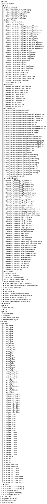

# File Structure of the fsio_lib Library

```plantuml
@startuml

salt
{
    {T
    <&folder> fsio_lib
    + <&folder> Documentation
    ++ <&folder> UML
    +++ <&folder> dynamic_import
    ++++ <&image> dynamic_import_from_module.png
    ++++ <&code> dynamic_import_from_module.pu
    ++++ <&code> dynamic_import_module.iuml
    ++++ <&image> dynamic_import_module.png
    ++++ <&code> dynamic_import_module.pu
    +++ <&folder> GenericParsers
    ++++ <&image> generic_parsers_classes.png
    ++++ <&code> generic_parsers_classes.pu
    ++++ <&image> generic_parsers_generic_parser_checkfile.png
    ++++ <&code> generic_parsers_generic_parser_checkfile.pu
    ++++ <&image> generic_parsers_generic_parser_checktemplate.png
    ++++ <&code> generic_parsers_generic_parser_checktemplate.pu
    ++++ <&image> generic_parsers_generic_parser_gethints.png
    ++++ <&code> generic_parsers_generic_parser_gethints.pu
    ++++ <&image> generic_parsers_generic_parser_parsefile.png
    ++++ <&code> generic_parsers_generic_parser_parsefile.pu
    ++++ <&image> generic_parsers_generic_parser_parsemanyfiles.png
    ++++ <&code> generic_parsers_generic_parser_parsemanyfiles.pu
    ++++ <&image> generic_parsers_generic_parser_parsesingleobject.png
    ++++ <&code> generic_parsers_generic_parser_parsesingleobject.pu
    ++++ <&code> generic_parsers_generic_parser.iuml
    ++++ <&image> generic_parsers_json_parser_gethints.png
    ++++ <&code> generic_parsers_json_parser_gethints.pu
    ++++ <&image> generic_parsers_json_parser_loadfile.png
    ++++ <&code> generic_parsers_json_parser_loadfile.pu
    ++++ <&code> generic_parsers_json_parser.iuml
    ++++ <&image> generic_parsers_parsefile.png
    ++++ <&code> generic_parsers_parsefile.pu
    ++++ <&image> generic_parsers_tsv_parser_loadfile.png
    ++++ <&code> generic_parsers_tsv_parser_loadfile.pu
    ++++ <&code> generic_parsers_tsv_parser.iuml
    ++++ <&image> generic_parsers_use_cases.png
    ++++ <&code> generic_parsers_use_cases.pu
    ++++ <&image> generic_parsers_xml_parser_loadfile.png
    ++++ <&code> generic_parsers_xml_parser_loadfile.pu
    ++++ <&code> generic_parsers_xml_parser.iuml
    ++++ <&code> GenericParsers.iuml
    +++ <&folder> locale_fsio
    ++++ <&image> locale_fsio_convert_from_string.png
    ++++ <&code> locale_fsio_convert_from_string.pu
    ++++ <&image> locale_fsio_detect_notation.png
    ++++ <&code> locale_fsio_detect_notation.pu
    ++++ <&image> locale_fsio_load_lines.png
    ++++ <&code> locale_fsio_load_lines.pu
    ++++ <&image> locale_fsio_load_table.png
    ++++ <&code> locale_fsio_load_table.pu
    ++++ <&code> locale_fsio_module.iuml
    ++++ <&image> locale_fsio_split_line.png
    ++++ <&code> locale_fsio_split_line.pu
    +++ <&folder> LoggingFSIO
    ++++ <&image> fsio_lib_logging_fsio_classes.png
    ++++ <&code> fsio_lib_logging_fsio_classes.pu
    ++++ <&image> fsio_lib_logging_fsio_consolelogger_enablelogging.png
    ++++ <&code> fsio_lib_logging_fsio_consolelogger_enablelogging.pu
    ++++ <&image> fsio_lib_logging_fsio_consolelogger_getattribute.png
    ++++ <&code> fsio_lib_logging_fsio_consolelogger_getattribute.pu
    ++++ <&image> fsio_lib_logging_fsio_consolelogger_init.png
    ++++ <&code> fsio_lib_logging_fsio_consolelogger_init.pu
    ++++ <&image> fsio_lib_logging_fsio_consolelogger_logging_methods.png
    ++++ <&code> fsio_lib_logging_fsio_consolelogger_logging_methods.pu
    ++++ <&image> fsio_lib_logging_fsio_consolelogger_setattr.png
    ++++ <&code> fsio_lib_logging_fsio_consolelogger_setattr.pu
    ++++ <&code> fsio_lib_logging_fsio_consolelogger.iuml
    ++++ <&image> fsio_lib_logging_fsio_duallogger_changelogfile.png
    ++++ <&code> fsio_lib_logging_fsio_duallogger_changelogfile.pu
    ++++ <&image> fsio_lib_logging_fsio_duallogger_enablefilelogging.png
    ++++ <&code> fsio_lib_logging_fsio_duallogger_enablefilelogging.pu
    ++++ <&image> fsio_lib_logging_fsio_duallogger_disablefilelogging.png
    ++++ <&code> fsio_lib_logging_fsio_duallogger_disablefilelogging.pu
    ++++ <&image> fsio_lib_logging_fsio_duallogger_init.png
    ++++ <&code> fsio_lib_logging_fsio_duallogger_init.pu
    ++++ <&code> fsio_lib_logging_fsio_duallogger.iuml
    ++++ <&image> fsio_lib_logging_fsio_loggingfsio_copyfile.png
    ++++ <&code> fsio_lib_logging_fsio_loggingfsio_copyfile.pu
    ++++ <&image> fsio_lib_logging_fsio_loggingfsio_deletefile.png
    ++++ <&code> fsio_lib_logging_fsio_loggingfsio_deletefile.pu
    ++++ <&image> fsio_lib_logging_fsio_loggingfsio_makedirs.png
    ++++ <&code> fsio_lib_logging_fsio_loggingfsio_makedirs.pu
    ++++ <&image> fsio_lib_logging_fsio_loggingfsio_movefile.png
    ++++ <&code> fsio_lib_logging_fsio_loggingfsio_movefile.pu
    ++++ <&image> fsio_lib_logging_fsio_loggingfsio_renamefile.png
    ++++ <&code> fsio_lib_logging_fsio_loggingfsio_renamefile.pu
    ++++ <&code> fsio_lib_logging_fsio_loggingfsio.iuml
    ++++ <&code> LoggingFSIO_module.iuml
    +++ <&folder> StructureMapping
    ++++ <&image> structure_mapping_add_element.png
    ++++ <&code> structure_mapping_add_element.pu
    ++++ <&image> structure_mapping_applyadditions.png
    ++++ <&code> structure_mapping_applyadditions.pu
    ++++ <&image> structure_mapping_applyremovals.png
    ++++ <&code> structure_mapping_applyremovals.pu
    ++++ <&image> structure_mapping_applysubstitutions.png
    ++++ <&code> structure_mapping_applysubstitutions.pu
    ++++ <&image> structure_mapping_components.png
    ++++ <&code> structure_mapping_components.pu
    ++++ <&image> structure_mapping_delete_element.png
    ++++ <&code> structure_mapping_delete_element.pu
    ++++ <&image> structure_mapping_extractextras.png
    ++++ <&code> structure_mapping_extraxtextras.pu
    ++++ <&image> structure_mapping_extractpathsubstitutions.png
    ++++ <&code> structure_mapping_extractpathsubstitutions.pu
    ++++ <&image> structure_mapping_extactvaluesubstitutions.png
    ++++ <&code> structure_mapping_extractvaluesubstitutions.pu
    ++++ <&image> structure_mapping_flatten_path.png
    ++++ <&code> structure_mapping_flatten_path.pu
    ++++ <&image> structure_mapping_get_element.png
    ++++ <&code> structure_mapping_get_element.pu
    ++++ <&image> structure_mapping_getpathpairs.png
    ++++ <&code> structure_mapping_getpathpairs.pu
    ++++ <&image> structure_mapping_load_definition.png
    ++++ <&code> structure_mapping_load_definition.pu
    ++++ <&image> structure_mapping_lograise.png
    ++++ <&code> structure_mapping_lograise.pu
    ++++ <&image> structure_mapping_map_values.png
    ++++ <&code> structure_mapping_map_values.pu
    ++++ <&image> structure_mapping_resolve_path_substitutions.png
    ++++ <&code> structure_mapping_resolve_path_substitutions.pu
    ++++ <&image> structure_mapping_selectadditionrules.png
    ++++ <&code> structure_mapping_selectadditionrules.pu
    ++++ <&image> structure_mapping_selectdirectrules.png
    ++++ <&code> structure_mapping_selectdirectrules.pu
    ++++ <&image> structure_mapping_selectremovalrules.png
    ++++ <&code> structure_mapping_selectremovalrules.pu
    ++++ <&image> structure_mapping_set_element.png
    ++++ <&code> structure_mapping_set_element.pu
    ++++ <&image> structure_mapping_use_case.png
    ++++ <&code> structure_mapping_use_case.pu
    ++++ <&image> structure_mapping_walkdict.png
    ++++ <&code> structure_mapping_walkdict.pu
    ++++ <&code> structure_mapping.iuml
    +++ <&folder> Templates
    ++++ <&code> Classes.cuml
    ++++ <&code> Components.cuml
    ++++ <&code> General_templates.cuml
    +++ <&code> FSIO_Lib Library_Components.pu
    +++ <&image> fsio_lib_components.png
    ++ <&document> DE001_Mapping_DSL_Specifications.md
    ++ <&document> DE002_Mapping_Template_Files_Specification.md
    ++ <&info> fsio_lib_Files_System.md
    ++ <&document> index.md
    ++ <&document> test_results.md
    ++ <&document> UD001_LoggingFSIO_Reference.md
    ++ <&document> UD002_StructureMapping_Reference.md
    ++ <&document> UD003_locale_fsio_Reference.md
    ++ <&document> UD004_dynamic_import_Reference.md
    ++ <&document> UD005_GenericParsers_Reference.md
    + <&folder> Templates
    ++ <&folder> JSON
    +++ json_test.json
    ++ <&folder> TSV
    ++ <&folder> XML
    +++ xml_test.json
    ++ index.json
    ++ json_search_index.json
    ++ xml_search_index.json
    + <&folder> Tests
    ++ <&folder> Input
    +++ <&check> bad_1.json
    +++ <&check> bad_2.json
    +++ <&check> bad_3.json
    +++ <&check> bad_4.json
    +++ <&check> bad_5.json
    +++ <&check> bad_6.json
    +++ <&check> bad_7.json
    +++ <&check> bad_8.json
    +++ <&check> bad_9.json
    +++ <&check> bad_10.json
    +++ <&check> bad_11.json
    +++ <&check> circular_1.json
    +++ <&check> circular_2.json
    +++ <&check> dummy.json
    +++ <&check> dummy.txt
    +++ <&check> dummy.xml
    +++ <&check> dummy0.json
    +++ <&check> dummy0.xml
    +++ <&check> dummy1.json
    +++ <&check> dummy1.txt
    +++ <&check> dummy1.xml
    +++ <&check> dummy2.json
    +++ <&check> dummy3.json
    +++ <&check> empty_path_1.json
    +++ <&check> empty_path_2.json
    +++ <&check> empty_path_3.json
    +++ <&check> empty_path_4.json
    +++ <&check> good_1.json
    +++ <&check> good_2_check.json
    +++ <&check> good_2.json
    +++ <&check> good_3_check.json
    +++ <&check> good_3.json
    +++ <&check> good_4_check.json
    +++ <&check> good_4.json
    +++ <&check> missing_path_1.json
    +++ <&check> missing_path_2.json
    +++ <&check> missing_path_3.json
    +++ <&check> missing_path_4.json
    +++ <&check> missing_path_5.json
    +++ <&check> missing_value_1.json
    +++ <&check> missing_value_2.json
    +++ <&check> missing_value_3.json
    +++ <&check> missing_value_4.json
    +++ <&check> missing_value_5.json
    +++ <&check> spelling_1.json
    +++ <&check> spelling_2.json
    +++ <&check> spelling_3.json
    +++ <&check> spelling_4.json
    +++ <&check> spelling_5.json
    +++ <&check> spelling_6.json
    +++ <&check> spelling_7.json
    +++ <&check> spelling_8.json
    +++ <&check> spelling_9.json
    +++ <&check> spelling_10.json
    +++ <&check> spelling_11.json
    +++ <&check> spelling_12.json
    +++ <&check> spelling_13.json
    +++ <&check> spelling_14.json
    +++ <&check> spelling_15.json
    +++ <&check> spelling_16.json
    +++ <&check> spelling_17.json
    +++ <&check> spelling_18.json
    +++ <&check> spelling_19.json
    +++ <&check> spelling_20.json
    +++ <&check> spelling_21.json
    +++ <&check> test_sp.txt
    +++ <&check> test.fbr
    +++ <&check> test.lin
    +++ <&check> test.lmp
    +++ <&check> undef_path_1.json
    +++ <&check> undef_path_2.json
    +++ <&check> wrong_path_1.json
    +++ <&check> wrong_path_2.json
    +++ <&check> wrong_path_3.json
    +++ <&check> wrong_path_4.json
    +++ <&check> wrong_path_name_1.json
    +++ <&check> wrong_path_name_2.json
    +++ <&check> wrong_path_value_1.json
    +++ <&check> wrong_path_value_2.json
    ++ <&folder> Output
    ++ <&script> ut001_structure_mapping.py
    ++ <&script> ut002_structure_mapping.py
    ++ <&script> ut003_locale_fsio.py
    ++ <&script> ut004_generic_parsers.py
    ++ <&script> ut004_helper_class.py
    + <&script> _ _init_ _.py
    + <&script> dynamic_import.py
    + <&script> GenericParsers.py
    + <&script> locale_fsio.py
    + <&script> LoggingFSIO.py
    + <&script> StructureMapping.py
    + <&info> README.md
    + <&info> Release_log.md
    }
}

@enduml
```