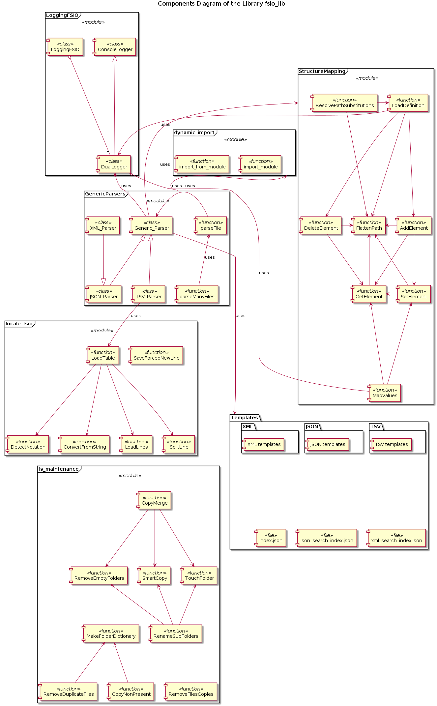
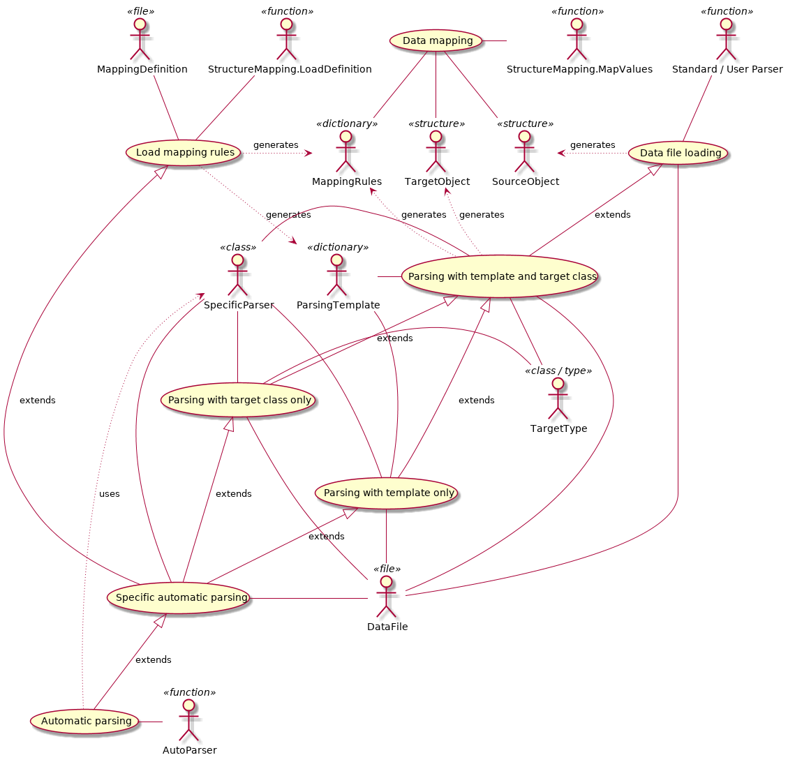

# Library fsio_lib

## Table of Content

* [Goal](#Goal)
* [Structure and Functionality](#Structure-and-Functionality)
* [Documentation](#Documentation)

## Goal

This library implements common functionality for the data processing, mostly concerning the batch operations, work flow automatization and structured data files reading and writing. All implemented functionality is generic without concerns about specifics of proprietary or highly specialized file formats or details of the actual data processing. The goal is to provide a common, uniform API for the (batch) files I/O.

## Structure and Functionality

### LoggingFSIO

Implements 'safe/smart' copy / move / rename / delete file operations, which intercept OS and I/O related exceptions raised during operations, which are logged into console and / or file and returned as the result of an operation.

### Module StructureMapping

Implements functions for mapping the content of a nested C struct (or Pascal record) like objects, nested dictionaries, nested sequences or even XML representation objects (xml.etree.ElementTree.Element class) onto another object of one of these types using defined templates.

### Module locale_fsio

Implements functions for locale independent writing of tabulated data ASCII text files (TSV format) concerning the new line, decimal separator and delimiter conventions as well as use of usual spaces instead of TABs for the columns separation. Also implements function, which forces specific new line convention.

### Module dynamic_import

Implements functions to import modules or objects from modules dynamically, i.e. using their string names at the runtime.

### GenericParsers

Implements singleton classes for parsing TSV, XML and JSON files with the data mapping onto specified class instances using the specified templates. Also defines generic parsing functions, which automatically select the required parsing class.

### Structure of the Library

### Intended Use Cases

## Documentation

All documentation can be found in the *Documentation* folder (see [Index](./Documentation/index.md)), and it is written using Markdown format.

### Design and Requirements

* [DE001 Mapping DSL Specification](./Documentation/DE001_Mapping_DSL_Specification.md)
* [DE002 Mapping Template Files Specification](./Documentation/DE002_Mapping_Template_Files_Specification.md)

### Tests

* [Unit and Functional Testing](./Documentation/test_results.md)

### User Documentation

* [UD001 LoggingFSIO Reference](./Documentation/UD001_LoggingFSIO_Reference.md)
* [UD002 StructureMapping Reference](./Documentation/UD002_StructureMapping_Reference.md)
* [UD003 locale_fsio Reference](./Documentation/UD003_locale_fsio_Reference.md)
* [UD004 dynamic_import Reference](./Documentation/UD004_dynamic_import_Reference.md)
* [UD005 GenericParsers Reference](./Documentation/UD005_GenericParsers_Reference.md)